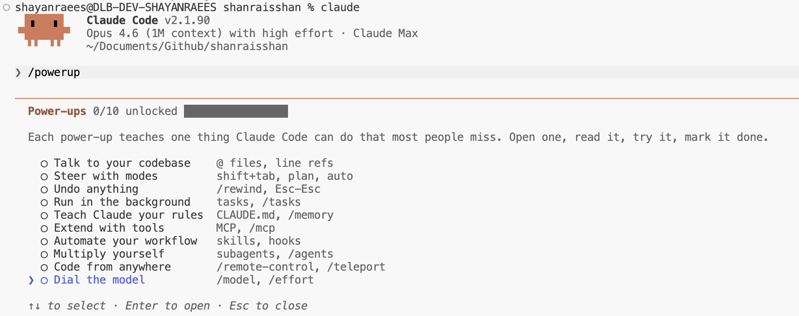
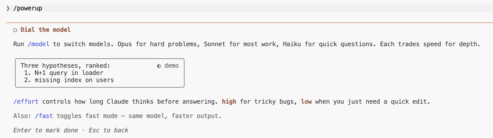

# 增强功能最佳实践


通过动画演示教授 Claude Code 功能的交互式课程。每个增强功能教授一个大多数人容易忽略的 Claude Code 能力。在 v2.1.90 中引入。

[← 返回 Claude Code 最佳实践](../)

---

## 用法

```bash
claude
/powerup
```

---

## 增强功能 (10)

<p align="center">
  
</p>

| # | 增强功能 | 主题 |
|---|----------|------|
| 1 | 与代码库对话 | `@` 文件、行引用 |
| 2 | 使用模式导航 | `shift+tab`、计划、自动 |
| 3 | 撤销任何操作 | `/rewind`、`Esc-Esc` |
| 4 | 后台运行 | 任务、`/tasks` |
| 5 | 教 Claude 你的规则 | `CLAUDE.md`、`/memory` |
| 6 | 使用工具扩展 | MCP、`/mcp` |
| 7 | 自动化你的工作流 | 技能、钩子 |
| 8 | 自我复制 | 子代理、`/agents` |
| 9 | 随处编码 | `/remote-control`、`/teleport` |
| 10 | 调整模型 | `/model`、`/effort` |

---

## 示例：调整模型

最后一个增强功能通过动画演示教授模型切换和努力程度控制。

<p align="center">
  
</p>

<p align="center">
  
</p>

<p align="center">
  
</p>

---

## 来源

- [变更日志 — v2.1.90](https://code.claude.com/docs/en/changelog)
