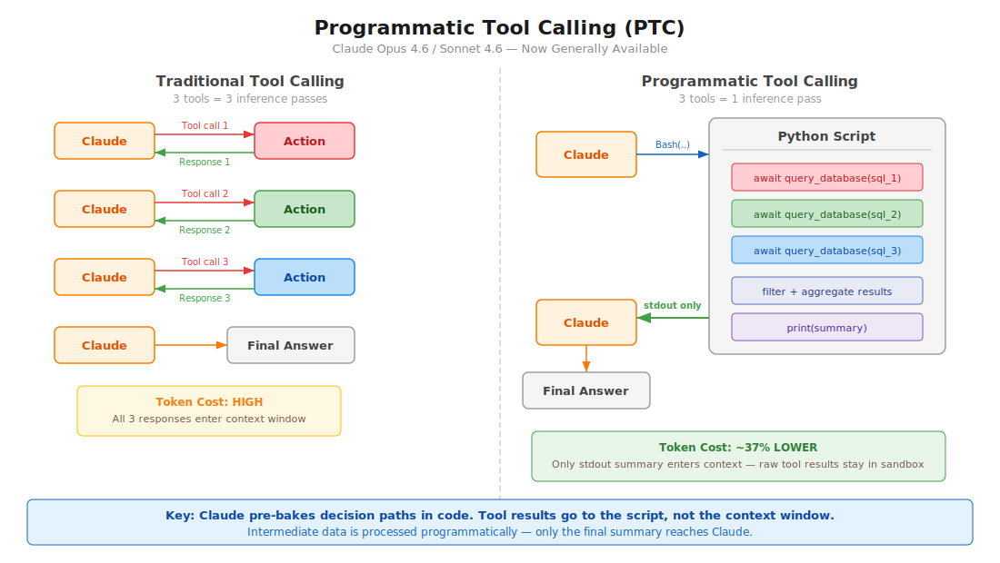

# Claude 高级工具使用模式

API 级别功能（现已正式发布），可减少 token 消耗、延迟，并提高工具准确性。随 Opus/Sonnet 4.6 发布。

[← 返回 Claude Code 最佳实践](../)

## 目录

1. [概述](#概述)
2. [程序化工具调用 (PTC)](#程序化工具调用-ptc)
3. [网页搜索/获取的动态过滤](#网页搜索获取的动态过滤)
4. [工具搜索工具](#工具搜索工具)
5. [工具使用示例](#工具使用示例)
6. [Claude Code 相关性](#claude-code-相关性)

---

## 概述

| 功能 | 解决的问题 | Token 节省 | 可用性 |
|------|-----------|-----------|--------|
| 程序化工具调用 | 多步骤代理循环在往返中消耗大量 token | 减少约 37% | API、Foundry（正式版） |
| 动态过滤 | 网页搜索/获取结果用无关内容膨胀上下文 | 输入 token 减少约 24% | API、Foundry（正式版） |
| 工具搜索工具 | 过多的工具定义膨胀上下文 | 减少约 85% | API、Foundry（正式版） |
| 工具使用示例 | 仅靠 Schema 无法表达使用模式 | 准确率从 72% 提升到 90% | API、Foundry（正式版） |

所有功能自 2026 年 2 月 18 日起**正式发布**。

**策略性分层** — 从最大的瓶颈开始：
- 工具定义导致的上下文膨胀 → 工具搜索工具
- 大量中间结果 → 程序化工具调用
- 网页搜索噪音 → 动态过滤
- 参数错误 → 工具使用示例

---

## 程序化工具调用 (PTC)



### 范式转变

**之前（传统工具调用）：**
```
用户提示 → Claude → 工具调用 1 → 响应 1 → Claude → 工具调用 2 → 响应 2 → Claude → 工具调用 3 → 响应 3 → Claude → 最终答案
```
每次工具调用都需要一次完整的模型往返。3 个工具 = 3 次推理。

**之后（程序化工具调用）：**
```
用户提示 → Claude → 编写 Python 脚本 → 脚本内部调用工具 1、工具 2、工具 3 → 标准输出 → Claude → 最终答案
```
Claude 编写代码来编排所有工具。只有最终的 `stdout` 进入上下文窗口。3 个工具 = 1 次推理。

### 工作原理

1. 你使用 `allowed_callers: ["code_execution_20250825"]` 定义工具
2. Claude 编写 Python 代码，在沙箱中以异步函数的形式调用这些工具
3. 当工具函数被调用时，沙箱暂停，API 返回一个 `tool_use` 块
4. 你提供工具结果 — 它进入**运行中的代码**，而不是 Claude 的上下文
5. 代码恢复执行，处理结果，如需要可调用更多工具
6. 只有最终执行的 `stdout` 到达 Claude

### 关键配置

```json
{
  "tools": [
    {
      "type": "code_execution_20250825",
      "name": "code_execution"
    },
    {
      "name": "query_database",
      "description": "Execute a SQL query. Returns rows as JSON objects with fields: id (str), name (str), revenue (float).",
      "input_schema": {
        "type": "object",
        "properties": {
          "sql": { "type": "string", "description": "SQL query to execute" }
        },
        "required": ["sql"]
      },
      "allowed_callers": ["code_execution_20250825"]
    }
  ]
}
```

### `allowed_callers` 字段

| 值 | 行为 |
|----|------|
| `["direct"]` | 仅传统工具调用（省略时的默认值） |
| `["code_execution_20250825"]` | 仅可从 Python 沙箱中调用 |
| `["direct", "code_execution_20250825"]` | 两种模式都可用 |

**建议：** 每个工具选择一种模式，而不是两种都用。这能给 Claude 更明确的指引。

### 响应中的 `caller` 字段

每个工具使用块都包含一个 `caller` 字段，让你知道它是如何被调用的：

```json
// 直接调用（传统方式）
{ "caller": { "type": "direct" } }

// 程序化调用（从代码执行中）
{ "caller": { "type": "code_execution_20250825", "tool_id": "srvtoolu_abc123" } }
```

### 高级模式

**批量处理** — 在 1 次推理中处理 N 个项目：
```python
regions = ["West", "East", "Central", "North", "South"]
results = {}
for region in regions:
    data = await query_database(f"SELECT SUM(revenue) FROM sales WHERE region='{region}'")
    results[region] = data[0]["revenue"]

top = max(results.items(), key=lambda x: x[1])
print(f"Top region: {top[0]} with ${top[1]:,}")
```

**提前终止** — 满足成功条件时立即停止：
```python
endpoints = ["us-east", "eu-west", "apac"]
for endpoint in endpoints:
    status = await check_health(endpoint)
    if status == "healthy":
        print(f"Found healthy endpoint: {endpoint}")
        break
```

**条件工具选择：**
```python
file_info = await get_file_info(path)
if file_info["size"] < 10000:
    content = await read_full_file(path)
else:
    content = await read_file_summary(path)
print(content)
```

**数据过滤** — 减少 Claude 看到的内容：
```python
logs = await fetch_logs(server_id)
errors = [log for log in logs if "ERROR" in log]
print(f"Found {len(errors)} errors")
for error in errors[-10:]:
    print(error)
```

### 模型兼容性

| 模型 | 支持 |
|------|------|
| Claude Opus 4.6 | 是 |
| Claude Sonnet 4.6 | 是 |
| Claude Sonnet 4.5 | 是 |
| Claude Opus 4.5 | 是 |

### 约束条件

| 约束 | 详情 |
|------|------|
| **不支持 Bedrock/Vertex** | 仅限 API 和 Foundry |
| **不支持 MCP 工具** | MCP 连接器工具无法被程序化调用 |
| **不支持网页搜索/获取** | PTC 中不支持网页工具 |
| **不支持结构化输出** | `strict: true` 的工具不兼容 |
| **不支持强制工具选择** | `tool_choice` 无法强制 PTC |
| **容器生命周期** | 约 4.5 分钟后过期 |
| **ZDR** | 不受零数据保留覆盖 |
| **工具结果为字符串** | 需验证外部结果以防代码注入风险 |

### 何时使用 PTC

| 适合的场景 | 不太理想的场景 |
|-----------|--------------|
| 处理需要聚合的大型数据集 | 响应简单的单次工具调用 |
| 3 个以上依赖的顺序工具调用 | 需要即时用户反馈的工具 |
| 在 Claude 看到结果前进行过滤/转换 | 非常快速的操作（开销大于收益） |
| 跨多个项目的并行操作 | |
| 基于中间结果的条件逻辑 | |

### Token 效率

- 程序化调用的工具结果**不会添加到 Claude 的上下文中** — 只有最终的 `stdout`
- 中间处理在代码中完成，而不是消耗模型 token
- 10 个工具的程序化调用 ≈ 10 次直接调用的 1/10 token

---

## 网页搜索/获取的动态过滤

### 问题

网页搜索和获取工具将完整的 HTML 页面倒入 Claude 的上下文窗口。其中大部分内容是无关的 — 导航、广告、模板。Claude 然后对所有内容进行推理，浪费 token 并降低准确性。

### 解决方案

Claude 现在**编写并执行 Python 代码来过滤网页结果**，在它们进入上下文窗口之前。Claude 不再对原始 HTML 进行推理，而是在沙箱中过滤、解析并仅提取相关内容。

### 工作原理

**之前：**
```
查询 → 搜索结果 → 获取完整 HTML × N 页 → 所有内容进入上下文 → Claude 对所有内容进行推理
```

**之后：**
```
查询 → 搜索结果 → Claude 编写过滤代码 → 代码仅提取相关内容 → 过滤后的结果进入上下文
```

### API 配置

使用更新的工具类型版本和 beta 请求头：

```json
{
  "model": "claude-opus-4-6",
  "max_tokens": 4096,
  "tools": [
    {
      "type": "web_search_20260209",
      "name": "web_search"
    },
    {
      "type": "web_fetch_20260209",
      "name": "web_fetch"
    }
  ]
}
```

**需要的请求头：** `anthropic-beta: code-execution-web-tools-2026-02-09`

在 Sonnet 4.6 和 Opus 4.6 中使用新工具类型版本时**默认启用**。

### 基准测试结果

**BrowseComp**（在网站上查找特定信息）：

| 模型 | 无过滤 | 有过滤 | 提升 |
|------|--------|--------|------|
| Sonnet 4.6 | 33.3% | **46.6%** | +13.3 百分点 |
| Opus 4.6 | 45.3% | **61.6%** | +16.3 百分点 |

**DeepsearchQA**（多步骤研究，F1 分数）：

| 模型 | 无过滤 | 有过滤 | 提升 |
|------|--------|--------|------|
| Sonnet 4.6 | 52.6% | **59.4%** | +6.8 百分点 |
| Opus 4.6 | 69.8% | **77.3%** | +7.5 百分点 |

**Token 效率：** 平均减少 24% 的输入 token。Sonnet 4.6 成本降低；Opus 4.6 可能因更复杂的过滤代码而略有增加。

### 使用场景

- 筛选技术文档
- 跨多个来源验证引用
- 交叉引用搜索结果
- 多步骤研究查询
- 在大型页面中查找埋藏的特定数据点

---

## 工具搜索工具

### 问题

预先加载所有工具定义会浪费上下文。如果你有 50 个 MCP 工具，每个约 1.5K token，那在用户提问之前就已经消耗了 75K token。

### 解决方案

用 `defer_loading: true` 标记不常用的工具。它们被排除在初始上下文之外。Claude 通过工具搜索工具按需发现它们。

### 配置

```json
{
  "tools": [
    {
      "type": "mcp_toolset",
      "mcp_server_name": "google-drive",
      "default_config": { "defer_loading": true },
      "configs": {
        "search_files": { "defer_loading": false }
      }
    }
  ]
}
```

### 最佳实践

- 保持 3-5 个最常用的工具始终加载，其余延迟加载
- 编写清晰、描述性的工具名称和描述（搜索依赖它们）
- 在系统提示中记录可用功能

### 何时使用

- 工具定义消耗超过 10K token
- 可用工具超过 10 个
- 多个 MCP 服务器
- 工具过多导致选择准确性问题

### Token 节省

工具定义 token 减少约 85%（Anthropic 基准测试中从 77K 降至 8.7K）。

### Claude Code 等效功能

Claude Code 有 **MCP 工具搜索自动模式**（自 v2.1.7 起默认启用）。当 MCP 工具描述超过上下文的 10% 时，它们会被延迟加载并通过 `MCPSearch` 发现。使用 `ENABLE_TOOL_SEARCH=auto:N`（N 为上下文百分比，0-100）配置阈值。

---

## 工具使用示例

### 问题

JSON Schema 定义了结构但无法表达：
- 何时包含可选参数
- 哪些参数组合有意义
- 格式约定（日期格式、ID 模式）
- 嵌套结构的使用方式

### 解决方案

在工具定义中添加 `input_examples` — Schema 之外的具体使用模式。

### 配置

```json
{
  "name": "create_ticket",
  "description": "Create a support ticket",
  "input_schema": {
    "type": "object",
    "properties": {
      "title": { "type": "string" },
      "priority": { "type": "string", "enum": ["low", "medium", "high", "critical"] },
      "assignee": { "type": "string" },
      "labels": { "type": "array", "items": { "type": "string" } }
    },
    "required": ["title"]
  },
  "input_examples": [
    {
      "title": "Login page returns 500 error",
      "priority": "critical",
      "assignee": "oncall-team",
      "labels": ["bug", "auth", "production"]
    },
    {
      "title": "Add dark mode support",
      "priority": "low",
      "labels": ["feature-request", "ui"]
    },
    {
      "title": "Update API docs for v2 endpoints"
    }
  ]
}
```

### 最佳实践

- 使用**真实数据**，而不是像 "example_value" 这样的占位字符串
- 展示**多样性**：最小、部分和完整规格
- 保持简洁：每个工具 **1-5 个示例**
- 专注于消除歧义 — 以行为清晰性为目标，而非 Schema 完整性
- 展示参数关联性（例如 `priority: "critical"` 通常会有 `assignee`）

### 结果

在 Anthropic 的基准测试中，复杂参数处理的准确率从 72% 提升到 90%。

---

## Claude Code 相关性

### 直接适用于 Claude Code 用户的功能

| 功能 | Claude Code 状态 | 操作建议 |
|------|-----------------|----------|
| 工具搜索 | 自 v2.1.7 起作为 MCPSearch 自动模式内置 | 如果你有很多 MCP 工具，调整 `ENABLE_TOOL_SEARCH=auto:N` |
| 动态过滤 | CLI 中不可用（API 级别的网页工具） | 适用于使用 Agent SDK 进行网页研究的开发者 |
| PTC | CLI 中不可用 | 适用于使用 Agent SDK 构建自定义代理的开发者 |
| 工具使用示例 | CLI 中不可配置 | 适用于自定义 MCP 服务器作者 |

### 面向 Agent SDK 开发者

如果你正在使用 `@anthropic-ai/claude-agent-sdk` 构建代理，PTC 可以立即应用：

1. 将 `code_execution_20250825` 添加到你的工具数组中
2. 在受益于批处理/过滤的工具上设置 `allowed_callers`
3. 实现工具结果循环（暂停 → 提供结果 → 恢复）
4. 从工具返回结构化数据（JSON）以便于程序化解析

### 面向 MCP 服务器作者

如果你正在构建自定义 MCP 服务器，工具使用示例可以改善 Claude 使用你工具的方式：
- 在工具 Schema 中添加 `input_examples`
- 在描述中清楚记录返回格式（PTC 需要解析它们）

---

## 来源

- [Anthropic 工程：高级工具使用](https://www.anthropic.com/engineering/advanced-tool-use)
- [程序化工具调用文档](https://platform.claude.com/docs/en/agents-and-tools/tool-use/programmatic-tool-calling)
- [代码执行工具文档](https://platform.claude.com/docs/en/agents-and-tools/tool-use/code-execution-tool)
- [改进的网页搜索与动态过滤](https://claude.com/blog/improved-web-search-with-dynamic-filtering)
