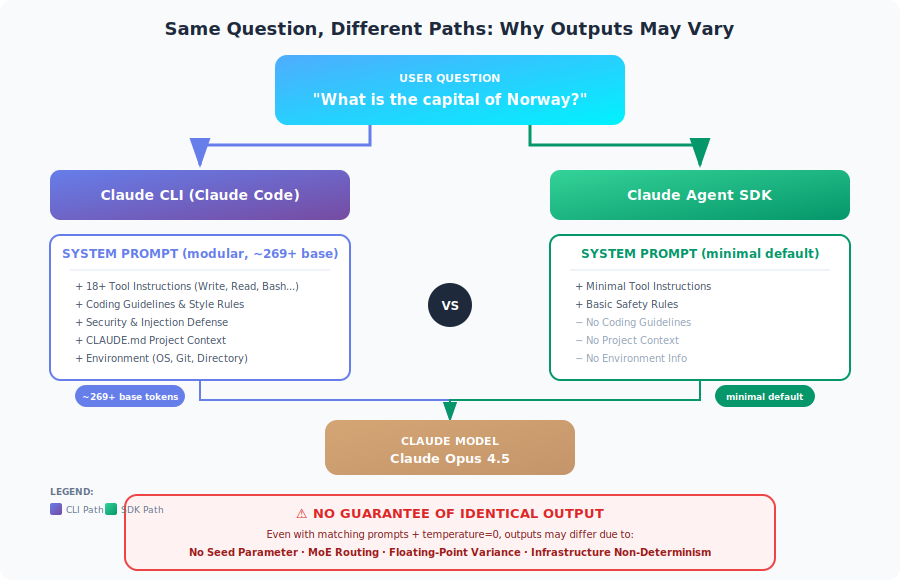

# Claude Agent SDK vs Claude CLI：系统提示与输出一致性

<table width="100%">
<tr>
<td><a href="../">← 返回 Claude Code 最佳实践</a></td>
<td align="right"></td>
</tr>
</table>



---

## 摘要

通过 **Claude Agent SDK** 和 **Claude CLI (Claude Code)** 发送同一条消息（例如"挪威的首都是什么？"）时，伴随这些消息的系统提示是根本不同的。CLI 使用**模块化系统提示架构**（约 269 个基础 token，根据功能条件加载额外上下文），而 SDK 默认使用最小提示。由于缺少 seed 参数以及 Claude 架构固有的非确定性，**无法保证两者输出完全相同**。

---

## 1. 系统提示比较

### Claude CLI (Claude Code)

Claude CLI 使用**模块化系统提示架构**，约 269 个 token 的基础提示，条件加载额外上下文：

| 组件 | 描述 | 加载方式 |
|------|------|---------|
| **基础系统提示** | 核心指令和行为 | 始终加载（约 269 token） |
| **工具指令** | 18+ 个内置工具（Write、Read、Edit、Bash、TodoWrite 等） | 始终加载 |
| **编码规范** | 代码风格、格式规则、安全实践 | 始终加载 |
| **安全规则** | 拒绝规则、注入防御、危害预防 | 始终加载 |
| **响应风格** | 语气、详细程度、解释深度、表情符号使用 | 始终加载 |
| **环境上下文** | 工作目录、git 状态、平台信息 | 始终加载 |
| **项目上下文** | CLAUDE.md 内容、设置、钩子配置 | 条件加载 |
| **子代理提示** | 计划模式、Explore 代理、Task 代理 | 条件加载 |
| **安全审查** | 扩展的安全指令（约 2,610 token） | 条件加载 |

**关键特征：**
- **模块化架构**，110+ 个系统提示字符串条件加载
- 基础提示适中（约 269 token），总量因激活的功能而异
- 包含广泛的安全和注入防御层
- 自动加载工作目录中的 CLAUDE.md 文件
- 交互模式中的会话持久上下文

### Claude Agent SDK

Agent SDK 默认使用**最小系统提示**，包含：

| 组件 | 描述 | Token 影响 |
|------|------|-----------|
| **基本工具指令** | 仅显式提供的工具 | 最小 |
| **基本安全** | 最小安全指令 | 最小 |

**关键特征：**
- 默认无编码规范或风格偏好
- 除非显式配置，否则无项目上下文
- 无详细的工具描述
- 需要显式配置才能匹配 CLI 行为

---

## 2. 各接口发送的内容

### 示例："挪威的首都是什么？"

#### 通过 Claude CLI

```
系统提示: [模块化，约 269+ 基础 token]
├── 基础系统提示（约 269 token）
├── 工具指令（Write、Read、Edit、Bash、Grep、Glob 等）
├── Git 安全协议
├── 代码引用规范
├── 专业客观性指令
├── 安全和注入防御规则
├── 环境上下文（操作系统、目录、日期）
├── CLAUDE.md 内容（如存在）[条件]
├── MCP 工具描述（如已配置）[条件]
├── 计划/Explore 模式提示 [条件]
└── 会话/对话上下文

用户消息: "挪威的首都是什么？"
```

#### 通过 Claude Agent SDK（默认）

```
系统提示: [最小]
├── 基本工具指令（如提供了任何工具）
└── 基本操作上下文

用户消息: "挪威的首都是什么？"
```

#### 通过 Agent SDK（使用 `claude_code` 预设）

```typescript
const response = await query({
  prompt: "What is the capital of Norway?",
  options: {
    systemPrompt: {
      type: "preset",
      preset: "claude_code"
    }
  }
});
```

```
系统提示: [模块化，匹配 CLI]
├── 完整的 Claude Code 系统提示
├── 工具指令
├── 编码规范
└── 安全规则

// 注意：除非配置了 settingSources，否则仍不包含 CLAUDE.md
```

---

## 3. 自定义方法

### Claude CLI 自定义

| 方法 | 命令 | 效果 |
|------|------|------|
| **追加到提示** | `claude -p "..." --append-system-prompt "..."` | 保留默认值并添加指令 |
| **替换提示** | `claude -p "..." --system-prompt "..."` | 完全替换系统提示 |
| **项目上下文** | CLAUDE.md 文件 | 自动加载，持久化 |
| **输出风格** | `/output-style [name]` | 应用预定义的响应风格 |

### Agent SDK 自定义

| 方法 | 配置 | 效果 |
|------|------|------|
| **自定义提示** | `systemPrompt: "..."` | 完全替换默认值（丢失工具） |
| **预设加追加** | `systemPrompt: { type: "preset", preset: "claude_code", append: "..." }` | 保留 CLI 功能 + 自定义指令 |
| **CLAUDE.md 加载** | `settingSources: ["project"]` | 加载项目级指令 |
| **输出风格** | `settingSources: ["user"]` 或 `settingSources: ["project"]` | 加载已保存的输出风格 |

### 配置比较表

| 功能 | CLI 默认 | SDK 默认 | SDK 使用预设 |
|------|---------|---------|-------------|
| 工具指令 | ✅ 完整 | ❌ 最小 | ✅ 完整 |
| 编码规范 | ✅ 是 | ❌ 否 | ✅ 是 |
| 安全规则 | ✅ 是 | ❌ 基本 | ✅ 是 |
| CLAUDE.md 自动加载 | ✅ 是 | ❌ 否 | ❌ 否* |
| 项目上下文 | ✅ 自动 | ❌ 否 | ❌ 否* |

*需要显式 `settingSources: ["project"]` 配置

---

## 4. 输出一致性保证

### 关键发现：无确定性保证

**Claude Messages API 不提供 seed 参数用于可重现性。** 这是一个根本性的架构限制。

### 阻碍输出完全相同的因素

| 因素 | 描述 | 可控？ |
|------|------|--------|
| **不同的系统提示** | CLI 和 SDK 有不同的默认值 | ✅ 是（通过配置） |
| **浮点运算** | 并行硬件的特殊性 | ❌ 否 |
| **MoE 路由** | 混合专家架构的变化 | ❌ 否 |
| **批处理/调度** | 云基础设施差异 | ❌ 否 |
| **数值精度** | 推理引擎变化 | ❌ 否 |
| **模型快照** | 版本更新/变更 | ❌ 否 |

### 温度和采样

即使 `temperature=0.0`（贪婪解码）：
- **不保证**完全确定性
- 由于基础设施因素仍可能出现微小变化
- 已知问题：[Claude CLI 对相同输入产生非确定性输出](https://github.com/anthropics/claude-code/issues/3370)

---

## 5. 实现最大一致性

要获得 SDK 和 CLI 之间**最接近的**相同输出：

### Agent SDK 配置

```typescript
import Anthropic from "@anthropic-ai/sdk";

const client = new Anthropic();

// 选项 1：使用 claude_code 预设
const response = await client.messages.create({
  model: "claude-sonnet-4-20250514",
  max_tokens: 1024,
  // 尽可能匹配 CLI 系统提示
  system: "Your exact system prompt matching CLI",
  messages: [
    { role: "user", content: "What is the capital of Norway?" }
  ],
  // 使用贪婪解码以获得最大一致性
  temperature: 0
});

// 选项 2：使用 Agent SDK 的 query 函数
import { query } from "@anthropic-ai/agent-sdk";

for await (const message of query({
  prompt: "What is the capital of Norway?",
  options: {
    systemPrompt: {
      type: "preset",
      preset: "claude_code"
    },
    temperature: 0,
    model: "claude-sonnet-4-20250514",
    // 像 CLI 一样加载项目上下文
    settingSources: ["project"]
  }
})) {
  // 处理响应
}
```

### CLI 配置

```bash
# 尽可能匹配 SDK 配置
claude -p "What is the capital of Norway?" \
  --model claude-sonnet-4-20250514 \
  --temperature 0
```

### 仍然无法保证

即使配置完全匹配：
- 不同运行之间输出可能不同
- SDK 和 CLI 之间输出可能不同
- 不存在 seed 参数来强制可重现性

---

## 6. 实际影响

### 何时使用各接口

| 使用场景 | 推荐接口 | 原因 |
|---------|---------|------|
| 交互式开发 | Claude CLI | 完整工具套件、项目上下文 |
| 程序化集成 | Agent SDK | 细粒度控制、嵌入 |
| 一致的 API 响应 | Agent SDK + 自定义提示 | 对系统提示有更多控制 |
| 批量处理 | Agent SDK | 更适合自动化流水线 |
| 一次性任务 | Claude CLI | 更快设置、即时上下文 |

### 设计建议

1. **不要依赖位级精确的可重现性**
   - 构建对微小输出变化具有鲁棒性的应用
   - 使用结构化输出和验证

2. **对于需要一致性的生产流水线：**
   - 尽可能缓存结果
   - 使用带有 JSON Schema 验证的结构化输出
   - 结合确定性逻辑和验证
   - 考虑多次生成并取共识

3. **在 SDK 中匹配 CLI 行为：**
   ```typescript
   systemPrompt: {
     type: "preset",
     preset: "claude_code",
     append: "Your additional instructions"
   },
   settingSources: ["project", "user"]
   ```

---

## 7. 系统提示的 Token 影响

| 配置 | 架构 | 备注 |
|------|------|------|
| SDK（最小） | 最小默认值 | 仅基本工具指令 |
| SDK（claude_code 预设） | 模块化（约 269+ 基础） | 匹配 CLI，因功能而异 |
| CLI（默认） | 模块化（约 269+ 基础） | 条件加载额外上下文 |
| CLI（使用 MCP 工具） | 模块化 + MCP | MCP 工具描述增加大量 token |

**注意：** Claude Code 使用模块化架构，包含 110+ 个系统提示字符串。基础提示约 269 token，各组件根据激活的功能从 18 到 2,610 token 不等。

**含义：** SDK 的最小默认值为你的实际任务提供了更多上下文，但代价是失去 Claude Code 的完整功能。

---

## 8. 总结表

| 方面 | Claude CLI | Agent SDK（默认） | Agent SDK（预设） |
|------|-----------|-----------------|-----------------|
| **系统提示** | 模块化（约 269+ 基础） | 最小 | 模块化（匹配 CLI） |
| **包含的工具** | 18+ 内置 | 仅在提供时 | 18+ 内置 |
| **CLAUDE.md 自动加载** | 是 | 否 | 否（需配置） |
| **编码规范** | 是 | 否 | 是 |
| **安全规则** | 完整 | 基本 | 完整 |
| **温度控制** | 是 | 是 | 是 |
| **确定性保证** | 否 | 否 | 否 |
| **输出完全相同？** | 不适用 | 否（与 CLI 比较） | 更接近，但否 |

---

## 9. 结论

**问：SDK 和 CLI 中同一消息附带什么系统提示？**

CLI 使用**模块化系统提示架构**，约 269 token 的基础提示和 110+ 个条件加载的组件（工具指令、编码规范、安全规则、项目上下文）。SDK 使用**最小默认值**，仅包含基本工具指令，但可以通过 `claude_code` 预设配置为匹配 CLI 行为。

**问：是否保证输出完全相同？**

**否。** 即使系统提示匹配、输入相同且 `temperature=0`，也无法保证输出完全相同，原因包括：
- Claude API 中缺少 seed 参数
- 浮点运算变化
- 基础设施级别的非确定性
- 模型架构（混合专家）路由变化

**建议：** 设计系统时应对输出变化具有鲁棒性，而不是依赖确定性行为。对于一致性关键的应用，使用结构化输出、缓存和验证层。

---

## 来源

- [修改系统提示 - Agent SDK](https://docs.anthropic.com/en/docs/agents-and-tools/claude-code/sdk#modifying-system-prompts)
- [Claude Code CLI 参考](https://docs.anthropic.com/en/docs/agents-and-tools/claude-code/cli)
- [Claude Code Headless 模式](https://docs.anthropic.com/en/docs/agents-and-tools/claude-code/headless)
- [Claude Code 最佳实践 - Anthropic 工程](https://www.anthropic.com/engineering/claude-code-best-practices)
- [Claude Messages API 参考](https://docs.anthropic.com/en/api/messages)
- [GitHub Issue #3370：非确定性输出](https://github.com/anthropics/claude-code/issues/3370)
- [Claude Code 系统提示仓库](https://github.com/Piebald-AI/claude-code-system-prompts) - 模块化提示架构分析
- [为什么 LLM 的确定性输出几乎不可能](https://unstract.com/blog/understanding-why-deterministic-output-from-llms-is-nearly-impossible/)

---

*本报告由 Claude Code 使用 Opus 4.5 模型于 2026 年 2 月 3 日生成。*
