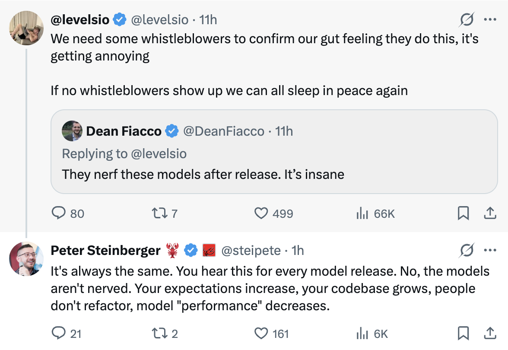

# LLM 日常质量波动：神话与现实

已部署的 LLM 在模型权重冻结的情况下，其性能是否会逐日变化？对已证实的原因、基础设施 Bug 和心理因素的深入分析。

<table width="100%">
<tr>
<td><a href="../">← 返回 Claude Code 最佳实践</a></td>
<td align="right"></td>
</tr>
</table>

---

<table width="100%">
<tr>
<td width="50%"><a href="https://x.com/nicksdot/status/2029520949176049704"></a></td>
<td width="50%"><a href="https://x.com/levelsio/status/2029369159893569680"></a></td>
</tr>
</table>

---
---

# 🔥 Claude Code Ops 4.6 分析。高推理

当 Anthropic 发布像 Opus 4.6 这样的模型时，**模型权重** — 数十亿个学习到的参数 — 是冻结的。训练是极其昂贵的（数百万美元，数周的算力）。没有人会在一夜之间重新训练模型。

但权重只是更大系统的一层。研究揭示了至少 **7 种不同的机制**可以导致真实或感知到的质量变化，即使模型权重是冻结的。

| 问题 | 答案 |
|------|------|
| 模型权重在发布后会改变吗？ | **不会** — 所有提供商已确认 |
| 模型行为会逐日不同吗？ | **会** — 已证明有 ±8-14% 的波动 |
| 这是有意的"削弱"吗？ | **不是** — 没有故意降质的证据 |
| 基础设施 Bug 是真实的吗？ | **是** — Anthropic 确认了 3 个影响高达 16% 请求的 Bug |
| 其中一部分是心理因素吗？ | **是** — 确认偏差和蜜月效应是真实存在的 |
| 系统提示/后训练会改变吗？ | **会** — 跨提供商有文档记录 |
| 用户应该相信自己的感知吗？ | **部分地** — 真实原因存在，但感知会放大它们 |

---

## 完整的推理栈

模型权重是冻结的，但**上面的九层**可以独立影响你的体验：

```
┌──────────────────────────────────────────────┐
│  你的会话上下文                                │  ← 在会话内退化
│  （累积的错误，长对话）                          │
├──────────────────────────────────────────────┤
│  系统提示                                     │  ← 定期更新
│  （安全规则，行为指令）                          │
├──────────────────────────────────────────────┤
│  后训练（RLHF / 微调）                         │  ← 可以悄悄更新
│  （指令跟随，安全对齐）                          │
├──────────────────────────────────────────────┤
│  采样参数                                     │  ← 可以在服务端调整
│  （temperature, top-p, top-k）                │
├──────────────────────────────────────────────┤
│  推测性解码                                    │  ← 草稿模型质量不一
│  （草稿模型预测 + 验证）                         │
├──────────────────────────────────────────────┤
│  MoE 路由 / 批次组成                            │  ← ±8-14% 波动已证实
│  （每个请求激活哪些专家）                         │
├──────────────────────────────────────────────┤
│  硬件路由                                      │  ← TPU vs GPU vs Trainium
│  （哪个集群服务你的请求）                         │
├──────────────────────────────────────────────┤
│  量化级别                                      │  ← 可能随负载变化
│  （FP16 vs INT8 vs INT4 精度）                 │
├──────────────────────────────────────────────┤
│  编译器和运行时                                  │  ← XLA Bug 已证实
│  （XLA:TPU, CUDA, 硬件特定代码）                 │
├──────────────────────────────────────────────┤
│  模型权重（冻结）                                │  ← 这些不会改变
│  （数十亿个学习到的参数）                         │
└──────────────────────────────────────────────┘
```

关键心智模型：**冻结的权重 ≠ 冻结的行为**。这就像说"同一个引擎 = 同样的驾驶体验"，却忽略了轮胎、路况、燃油质量和驾驶员疲劳。

---

## 已证实的原因：基础设施 Bug

### Anthropic 2025 年 9 月的事后分析

2025 年 9 月，Anthropic 发布了详细的事后分析，揭示了 2025 年 8 月至 9 月之间**三个独立的基础设施 Bug** 导致 Claude 质量下降。他们的官方声明：

> "我们从不因需求、时段或服务器负载而降低模型质量。用户报告的问题完全是由基础设施 Bug 导致的。"

### Bug #1 — 上下文窗口路由错误

Sonnet 4 的请求被意外路由到配置为 1M token 上下文窗口的服务器，而非标准服务器。

- **时间线**：8 月 5 日引入，8 月 29 日负载均衡变更后恶化
- **最大影响**：最严重时（8 月 31 日）16% 的 Sonnet 4 请求受影响
- **用户影响**：约 30% 的 Claude Code 用户至少有一条消息质量下降
- **隐蔽细节**：路由是"粘性"的 — 一旦你命中了有问题的服务器，后续请求继续发往那里
- **修复**：9 月 4-18 日（跨平台推出）

### Bug #2 — TPU 输出损坏

TPU 服务器上的配置错误导致 token 生成过程中出错，为本应罕见出现的 token 分配了高概率。

- **症状**：英文回复中出现泰文或中文字符，明显的代码语法错误
- **影响**：Opus 4.1 和 Opus 4（8 月 25-28 日），Sonnet 4（8 月 25 日 - 9 月 2 日）
- **范围**：仅 Claude API；第三方平台未受影响
- **修复**：9 月 2 日回滚

### Bug #3 — XLA:TPU 编译器误编译（最棘手的）

一个修复精度问题的代码变更意外暴露了 Google XLA:TPU 中的**潜在编译器 Bug**。

- **根本原因**：近似 top-k 操作（用于选择最可能的下一个 token）"有时会返回完全错误的结果，但仅在特定批次大小和模型配置下"
- **为什么难以发现**：它的行为取决于之前或之后运行了什么操作，以及是否启用了调试工具
- **隐藏数月**：2024 年 12 月的一个变通方案一直在意外地掩盖这个更深层的 Bug
- **影响**：Haiku 3.5 已确认；部分 Sonnet 4 和 Opus 3 疑似受影响
- **解决**：从近似 top-k 切换到精确 top-k；接受"轻微的效率影响"，因为"模型质量不可协商"

### 为什么检测困难

Anthropic 自己的自动化评估也没有捕获到用户报告的质量下降，"部分原因是 Claude 通常能很好地从个别错误中恢复。" 每个 Bug 在不同平台上以不同速率产生不同症状，造成了"一个令人困惑的报告混合体，没有指向任何单一原因。"

关键上下文：Claude 运行在**三种不同的硬件平台**（AWS Trainium、NVIDIA GPU、Google TPU）上，每种都有不同的故障模式、编译器和精度行为。你的请求可能在不同天命中不同的硬件。

---

## 已证实的原因：MoE 路由波动

现代大型模型通常使用**混合专家 (MoE)** 架构，其中每个输入只激活模型参数（"专家"）的一个子集。一个学习到的路由器决定使用哪些专家。

Scale AI 的研究揭示了一个关键发现：

> "稀疏 MoE 和批量推理的组合会产生不可预测的结果，因为批次的组成可以决定你的查询被路由到哪个专家，而同一批次中其他用户的查询混合不是确定性的。"

### 跨提供商的日常波动测量

| 提供商 | 日常分数波动 |
|--------|------------|
| OpenAI (GPT-4 系列) | ±10–12% |
| Anthropic (Claude 系列) | ±8–11% |
| Google (Gemini 系列) | ±9–14% |

具体示例：同一个模型在**越狱抵抗方面一天得分 77%，第二天得分 63%**。同一模型、同一权重、同一测试 — 仅因基础设施就有 14 个百分点的波动。

这意味着即使零 Bug 和零变更，同一模型在不同天纯粹因为请求的批处理和路由方式不同，就可以产生明显不同质量的输出。当日常噪声为 10-15% 时，A/B 测试无法可靠地检测到 5% 的质量信号。

---

## 已证实的原因：系统提示和后训练更新

### 系统提示变更

模型权重不变，但包裹这些权重的**系统提示**可以随时更新。对 Claude 系统提示演变的分析显示了数十次迭代，其中"热修复" — 为修补不期望行为而添加的简短指令 — 会定期添加和移除。

Claude 3.7 的系统提示包含多个针对常见 LLM "陷阱"的热修复指令。Claude 4.0 的系统提示移除了所有这些，转而在后训练中通过强化学习来处理这些行为。

### 后训练理论

对于无法解释的质量变化，最合理的理论是：公司可以更新**微调和 RLHF**（基于人类反馈的强化学习），而不改变基础模型权重。这在技术上使"模型没有改变"的说法是真实的，同时通过更新的安全护栏和指令跟随调整来改变行为。

---

## 已证实的原因：静默模型替换

OpenAI 已被多次记录静默更改用户交互的模型：

- 一夜之间移除模型选择器，强制用户从 GPT-4o 切换到 GPT-5
- 将 GPT-4o 变为隐藏的"遗留模型"，需要在设置中手动切换，没有应用内通知
- "自动切换器" Bug 将用户路由到错误的模型
- Plus 订阅者报告模型在未经同意的情况下切换到"受限版本"

Sam Altman 承认推出"比我们希望的稍微颠簸了一点。" Reddit 帖子获得了数千个赞，称新模型是"灾难"和"降级"。

这表明模型替换**确实发生在**行业中 — 有时是有意的（产品决策），有时是意外的（路由 Bug）。

---

## 贡献因素

### 负载下的量化

为了经济高效地服务数百万用户，公司可能会提供**量化**版本的模型 — 将精度从 FP16 降低到 INT8 或 INT4。这可以将内存使用减少 2-4 倍并加速推理，但会引入微妙的质量损失。提供商是否在负载下动态切换量化级别仍有争议，但这种技术能力已在 vLLM 和 TensorRT 等推理框架中得到充分文档记录。

### 推测性解码

现代推理栈使用较小的"草稿"模型来预测多个后续 token，然后由真实模型验证它们。理论上这保持了相同的输出分布，但实际中接受率因领域和上下文而异。开箱即用的草稿模型在某些情况下可能工作良好，但在领域特定任务或非常长的上下文中通常表现不佳。

### 上下文窗口污染

在长时间的编码会话中，早期的错误会在上下文中累积。模型看到自己的错误并可能延续它们。这是单个会话内"Claude 变笨了"最常见的原因 — 不是模型退化，而是上下文污染。

**实用提示**：当感觉质量下降时使用 `/compact` 或开始新会话。这是你能做的最有效的单个操作。

---

## 斯坦福研究 — 以及为什么它很复杂

斯坦福和加州大学伯克利分校 2023 年的里程碑式研究（Chen、Zaharia、Zou）— "ChatGPT 的行为如何随时间变化？" — 经常被引用为 LLM 退化的证据。标题发现：

> GPT-4 在"这个数字是素数吗？请逐步思考"问题上的准确率在 2023 年 3 月至 6 月之间从 **97.6% 降至 2.4%**。

### 研究证明了什么

- "同一个" LLM 服务的行为**可以在短期内发生重大变化**
- 不同的能力可以朝相反方向变化（GPT-4 数学变差，GPT-3.5 数学变好）
- 代码生成质量下降（GPT-4 可执行代码：52% → 10%）
- 该研究创造了 **"LLM 漂移"** 一词

### 方法论批评

- 3 月版本使用 **temperature 0.0** 而 6 月版本使用 **temperature 1.0** — 一个增加随机性的根本混淆变量
- 每个任务仅 **500 次查询** — 对于确定性统计声明来说太少
- "数学问题"实际上是是/否问题，模型的猜测模式改变了，而非数学能力
- 变化可能反映了有意的**后训练安全更新**，而非退化

该研究证明了一些重要的事情 — LLM 行为会随时间变化 — 但机制可能是有意的更新，而非无意的退化。

---

## 心理因素

### 确认偏差

一旦有人发推"Claude 今天很笨"，你就开始注意到每一个错误。在没人抱怨的日子里，你对同样的错误视而不见。社交媒体放大了这种效应。

### 蜜月效应

用户对新模型有一个初始的蜜月期，然后逐渐发现局限性。模型没有改变 — 是期望的上调速度超过了实际能力。

### 任务难度波动

你的任务每天都在变化。一天遇到的难题让人感觉模型变差了，即使它并没有。

### "周末 Claude"神话

尽管许多用户相信存在星期几的质量模式，严格的分析发现**没有一致的证据**支持星期几的质量模式。一项名为"AI 周一更笨"的分析一无所获。

### LLM 的随机本质

LLM 是概率性的。同一提示每次可以产生不同的输出。在运气不好的连续情况下，你可能连续得到几个糟糕的回复 — 纯粹是随机性，不是退化。

---

## 底线

用户描述的现象是**真实的但归因错误的**：

- **正确**：他们在某些天的体验确实下降了
- **不正确**：模型被故意"削弱"了

实际原因是以下因素的组合：

1. **基础设施 Bug** — Anthropic 事后分析证实（高达 16% 的请求受影响）
2. **MoE 路由波动** — Scale AI 测量到 ±8-14% 的质量波动，即使零变更
3. **系统提示和后训练更新** — 跨提供商有文档记录
4. **硬件异构性** — TPU vs GPU vs Trainium，各有不同的故障模式
5. **上下文污染** — 长会话会降低会话内质量
6. **确认偏差** — 社交媒体放大感知到的模式
7. **随机波动** — 同一模型、同一提示，每次不同的输出

测量问题很严重：日常 ±8-14% 的波动意味着你无法区分真实的 5% 质量变化和噪声。这就是为什么"全是你的幻觉"和"他们削弱了它"两个阵营都很自信 — 信噪比使得仅从个人经验无法判断。

---

## 来源

- [Anthropic：三个近期问题的事后分析](https://www.anthropic.com/engineering/a-postmortem-of-three-recent-issues) — 详细描述三个基础设施 Bug 的官方事后分析（2025 年 9 月）
- [Anthropic 揭示三个基础设施 Bug — InfoQ](https://www.infoq.com/news/2025/10/anthropic-infrastructure-bugs/) — 事后分析的技术分析
- [ChatGPT 的行为如何随时间变化？ — 斯坦福/加州大学伯克利](https://arxiv.org/abs/2307.09009) — LLM 漂移的里程碑式研究（2023）
- [关于 ChatGPT 能力退化的真相 — TechTalks](https://bdtechtalks.com/2023/07/24/chatgpt-capabilities-degrading-study/) — 斯坦福研究的方法论批评
- [LLM 正在变笨而我们不知道为什么 — Ignorance.ai](https://www.ignorance.ai/p/llms-are-getting-dumber-and-we-have) — 感知退化的五种理论
- [当 Claude 忘记如何编码 — Robert Matsuoka](https://hyperdev.matsuoka.com/p/when-claude-forgets-how-to-code) — Claude 质量波动和基础设施原因分析
- [消除 LLM 波动 — Scale AI](https://scale.com/blog/smoothing-out-llm-variance) — 跨提供商测量到 ±8-14% 的日常波动
- [从 Anthropic 的系统提示更新中我们能学到什么 — PromptLayer](https://blog.promptlayer.com/what-we-can-learn-from-anthropics-system-prompt-updates/) — 系统提示演变分析
- [Claude 的系统提示变更揭示了 Anthropic 的优先事项 — Drew Breunig](https://www.dbreunig.com/2025/06/03/comparing-system-prompts-across-claude-versions.html) — 系统提示中的热修复模式
- [关于静默切换模型的投诉 — OpenAI 论坛](https://community.openai.com/t/complaints-about-secretly-switching-models/1360150) — 记录在案的静默模型替换
- [推测性解码 — BentoML LLM 推理手册](https://bentoml.com/llm/inference-optimization/speculative-decoding) — 草稿模型如何影响推理
- [混合专家视觉指南 — Maarten Grootendorst](https://newsletter.maartengrootendorst.com/p/a-visual-guide-to-mixture-of-experts) — MoE 架构和路由详解

---
---

# 🔥 Codex 5.3 高推理与发现

### 报告范围

本节解释为什么用户可能在 Claude 输出质量下降的短暂窗口期内，感觉 Codex 5.3 在编码任务上更稳定或更强。重点不在于永久性的模型质量排名。重点是在真实推理条件下的短期生产行为。

报告日期：2026 年 3 月 5 日。

### 观察到的模式

报告的模式是：

1. 模型质量在一段时间内是可接受的。
2. 质量似乎退化了几天。
3. 质量恢复到接近之前的基线。

这种形状通常是推理栈或发布模式，而非永久性的基础模型能力变化。永久性的能力下降通常不会在没有显式回滚或修复的情况下如此快速恢复。

### 高推理：为什么 Codex 5.3 在糟糕窗口期看起来更好

Codex 5.3 在另一个提供商的退化期间可以明显表现更强，原因有几个技术因素可以同时发生：

1. 产品目标契合度。Codex 5.3 针对代码生成和代理编码工作流进行了优化，因此即使原始模型能力相当，由于工具编排、仓库推理和以代码为中心的指令微调，也能产生更好的编码结果。
2. 推理策略差异。提供商独立调整延迟、推理深度和解码默认值。一个提供商更保守的策略在同一天可以看起来比另一个激进的速度优化策略"更聪明"。
3. 推理路径分离。即使两个提供商都托管最先进的模型，它们运行不同的路由层、编译器/运行时栈和发布流水线。一个栈中的事故不意味着另一个栈中有相关的退化。
4. 发布和回滚时机。如果一个提供商正在发布而另一个是稳定的，用户可以看到大的临时质量差异，但模型权重没有任何长期变化。
5. 会话级污染效应。在长时间的编码聊天中，错误累积可以放大感知到的下降。竞争对手的助手可能仅仅因为失败的会话被重置了，或者因为其工具循环恢复得更快而感觉更好。

### 详细发现

对于像"Claude 在大约四天内感觉非常弱，然后恢复了"这样的报告，最可能的解释是：

1. 提供商端的事故、路由问题、解码/运行时 Bug 或发布回归影响了部分请求。
2. 问题持续时间足够长，在实际工作流中被反复注意到。
3. 问题被修复或回滚。
4. 感知到的质量迅速恢复。

在同一时期，Codex 5.3 可能感觉明显更好，因为它不共享相同的事故路径，而且编码任务优化放大了实际结果的差距。

### 假设排名

| 假设 | 可能性 | 理由 |
|------|--------|------|
| 提供商事故加回滚 | 高 | 与多天下降后快速恢复的模式最匹配 |
| 推理配置变更（采样/延迟/推理预算） | 高 | 无需模型重训练的突然行为变化的常见来源 |
| 静默别名或快照变动 | 中高 | 可以在用户无感知的情况下改变行为 |
| 仅提示漂移和上下文污染 | 中 | 可以退化会话，但不太可能单独解释广泛的多天报告 |
| 永久性基础模型退化 | 低 | 与快速恢复到之前质量的情况不一致 |

### 什么能确认或否定这个发现

要将其从高置信推理转变为硬证据，需要收集同一任务集在不同天的请求级遥测：

1. 请求时的确切模型标识符和快照/别名。
2. 提供商暴露的任何后端指纹或版本标记。
3. 解码参数（temperature、top_p、top_k、max tokens）。
4. 延迟、超时和错误率追踪。
5. 固定编码基准提示集上的结构化质量分数。
6. 失败点的会话长度和 token 上下文深度。

如果质量下降与事故窗口、配置变更或后端指纹变化相关联，则事故/配置假设得到确认。如果不存在此类变化且退化仅在长会话中出现，则上下文污染成为主要解释。

### 实用工程指南

减少生产中的日常波动：

1. 可用时固定模型快照，而不是使用浮动别名。
2. 存储请求元数据（模型 ID、参数、延迟、错误、响应质量标签）。
3. 为编码任务运行每日固定的金丝雀测试套件，并在回归时告警。
4. 在多次失败后重置或压缩长时间运行的会话。
5. 为事故窗口保留备用提供商/模型路径。
6. 在内部仪表板中将"模型质量"与"推理可靠性"分开。

### 最终结论

在 Claude 短暂退化窗口期间 Codex 5.3 看起来更好是现代 LLM 运营中技术上合理且预期中的结果。最强的解释不是永久性的模型崩溃。最强的解释是一个提供商的临时推理路径退化，加上编码特定优化和另一个提供商在同一时期的稳定运行。
