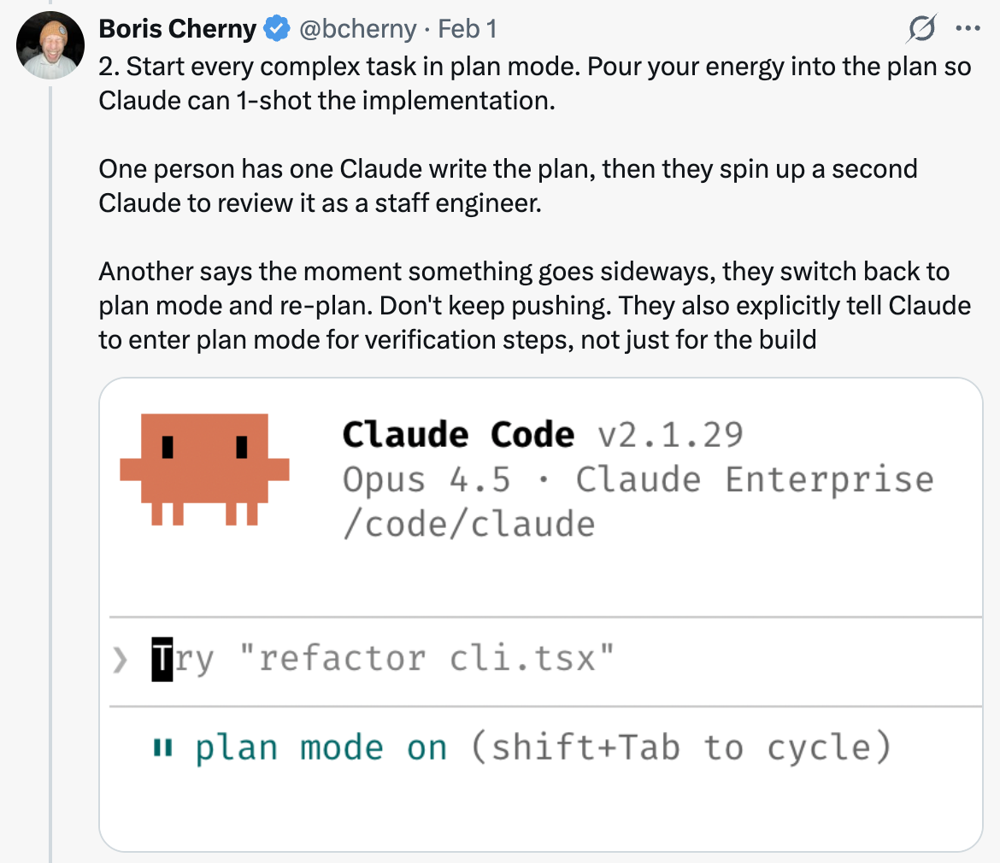
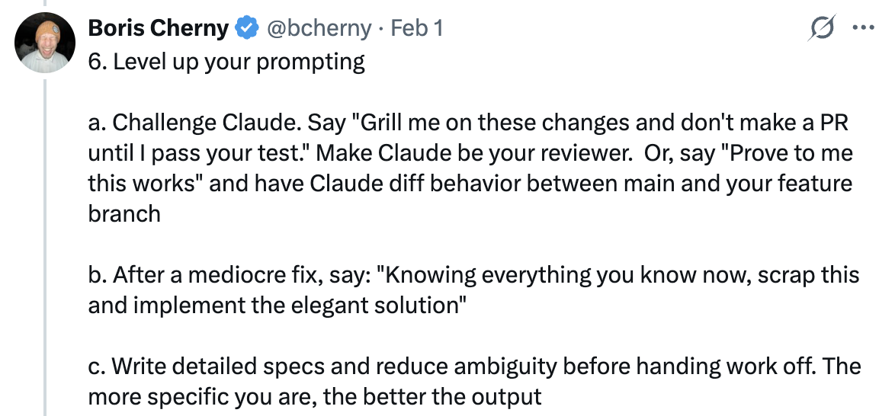

# 使用 Claude Code 的 10 个技巧 — 来自 Claude Code 团队

Boris Cherny ([@bcherny](https://x.com/bcherny))，Claude Code 的创建者，于 2026 年 2 月 1 日分享的团队技巧总结。

<table width="100%">
<tr>
<td><a href="../">← 返回 Claude Code 最佳实践</a></td>
<td align="right"></td>
</tr>
</table>

---

## 背景

Boris 分享了直接来自 Claude Code 团队的使用技巧。团队使用 Claude 的方式与 Boris 个人使用方式不同。记住：使用 Claude Code 没有唯一正确的方式 — 每个人的设置都不同。你应该多尝试，看看什么对你最有效！

---

## 1/ 更多地并行工作

同时启动 3-5 个 git 工作树，每个运行自己的 Claude 会话并行工作。这是最大的生产力提升，也是团队的首要技巧。Boris 个人使用多个 git checkout，但 Claude Code 团队大多数人更喜欢工作树 — 这就是 `@amorisscode` 在 Claude 桌面应用中内置原生支持的原因！

有些人还给工作树命名并设置 shell 别名（`2a`、`2b`、`2c`），这样可以一键切换。其他人有一个专门的"分析"工作树，只用于读取日志和运行 BigQuery。

参见：[工作树文档](https://code.claude.com/docs/en/common...)

---

## 2/ 每个复杂任务都从计划模式开始

把精力投入到计划中，让 Claude 一次性完成实现。

有人让一个 Claude 写计划，然后启动第二个 Claude 以高级工程师的身份审查。

另一个人说一旦事情偏离方向，就切换回计划模式并重新规划。不要硬推。他们还明确告诉 Claude 在验证步骤时进入计划模式，而不仅仅是在构建时。

---

## 3/ 投资你的 CLAUDE.md

每次纠正后，以此结束："更新你的 CLAUDE.md 这样你就不会再犯同样的错误了。" Claude 非常擅长为自己编写规则。

随时间无情地编辑你的 `CLAUDE.md`。持续迭代直到 Claude 的错误率明显下降。

一个工程师告诉 Claude 为每个任务/项目维护一个笔记目录，每次 PR 后更新。然后他们把 `CLAUDE.md` 指向它。

---

## 4/ 创建你自己的技能并提交到 Git

跨项目复用。来自团队的提示：

- 如果你一天做某事超过一次，就把它变成技能或命令
- 构建一个 `/techdebt` 斜杠命令，在每个会话结束时运行它来查找和清除重复代码
- 设置一个斜杠命令，将 7 天的 Slack、GDrive、Asana 和 GitHub 同步到一个上下文中
- 构建分析工程师风格的代理，编写 dbt 模型、审查代码，并在开发环境中测试变更

参见：[用技能扩展 Claude — Claude Code 文档](https://code.claude.com/docs/en/skills)

---

## 5/ Claude 自己就能修复大多数 Bug

团队是这样做的：

启用 Slack MCP，然后将 Slack 的 bug 讨论线程粘贴到 Claude 中，只说"修复"。零上下文切换。

或者，只说"去修复失败的 CI 测试。"不要微观管理怎么做。

让 Claude 查看 docker 日志来排查分布式系统 — 它在这方面出人意料地强大。

---

## 6/ 提升你的提示水平

a. **挑战 Claude。** 说"对我的这些更改进行严格审查，在我通过你的测试之前不要创建 PR。" 让 Claude 做你的审查员。或者说"向我证明这能用"，让 Claude 对比 main 和你的功能分支之间的行为差异。

b. **在平庸的修复之后，** 说："基于你现在知道的一切，废弃这个并实现优雅的解决方案。"

c. **在交接工作之前写详细的规格说明**并减少歧义。你越具体，输出就越好。

---

## 7/ 终端和环境设置

团队喜欢 Ghostty！多人喜欢它的同步渲染、24 位颜色和正确的 unicode 支持。

为了更轻松地切换 Claude，使用 `/statusline` 自定义状态栏，始终显示上下文使用情况和当前 git 分支。许多人还为终端标签着色和命名，有时使用 tmux — 每个任务/工作树一个标签。

使用语音听写。你说话的速度是打字的 3 倍，因此你的提示会变得更加详细。（在 macOS 上按两下 fn）

参见：[终端设置文档](https://code.claude.com/docs/en/termin...)

---

## 8/ 使用子代理

a. 在任何你希望 Claude 投入更多算力的请求后面追加"使用子代理"。

b. 将单个任务分配给子代理，以保持主代理的上下文窗口干净和专注。

c. 通过钩子将权限请求路由到 Opus 4.5 — 让它扫描攻击并自动批准安全的请求。参见：[钩子文档](https://code.claude.com/docs/en/hooks#...)

---

## 9/ 将 Claude 用于数据和分析

让 Claude Code 使用 "bq" CLI 即时拉取和分析指标。团队在代码库中签入了一个 BigQuery 技能，每个人都在 Claude Code 中直接用它进行分析查询。Boris 个人已经 6 个多月没写过一行 SQL 了。

这适用于任何有 CLI、MCP 或 API 的数据库。

---

## 10/ 用 Claude 学习

团队关于用 Claude Code 学习的几个提示：

a. 在 `/config` 中启用"Explanatory"或"Learning"输出风格，让 Claude 解释其更改背后的"为什么"。

b. 让 Claude 生成可视化的 HTML 演示文稿来解释不熟悉的代码。它做的幻灯片出人意料地好！

c. 让 Claude 绘制新协议和代码库的 ASCII 图表来帮助你理解它们。

d. 构建一个间隔重复学习技能：你解释你的理解，Claude 提出后续问题来填补空白，存储结果。

---

## 来源

- [Boris Cherny (@bcherny) on X — 2026 年 2 月 1 日](https://x.com/bcherny/status/2017742741636321619)
