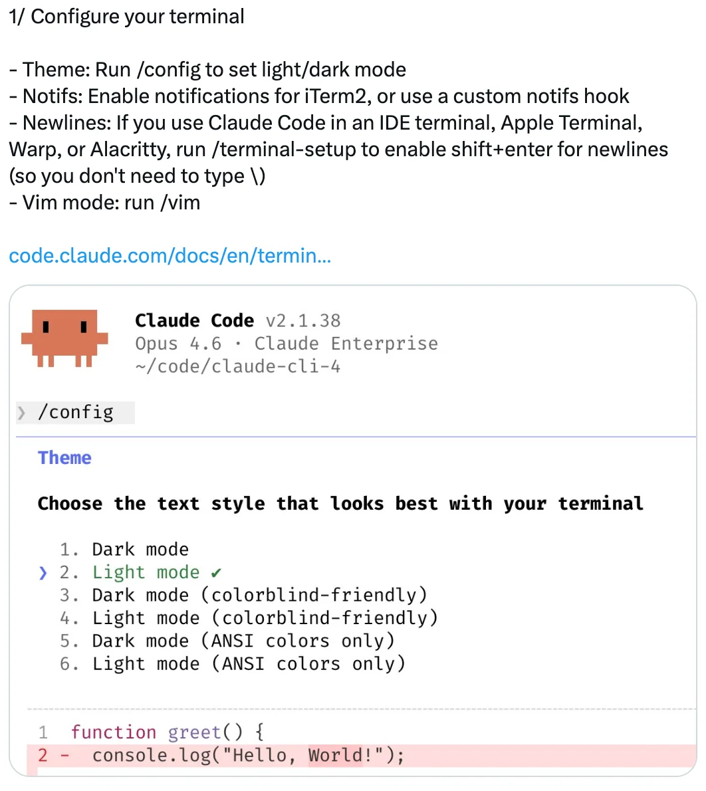
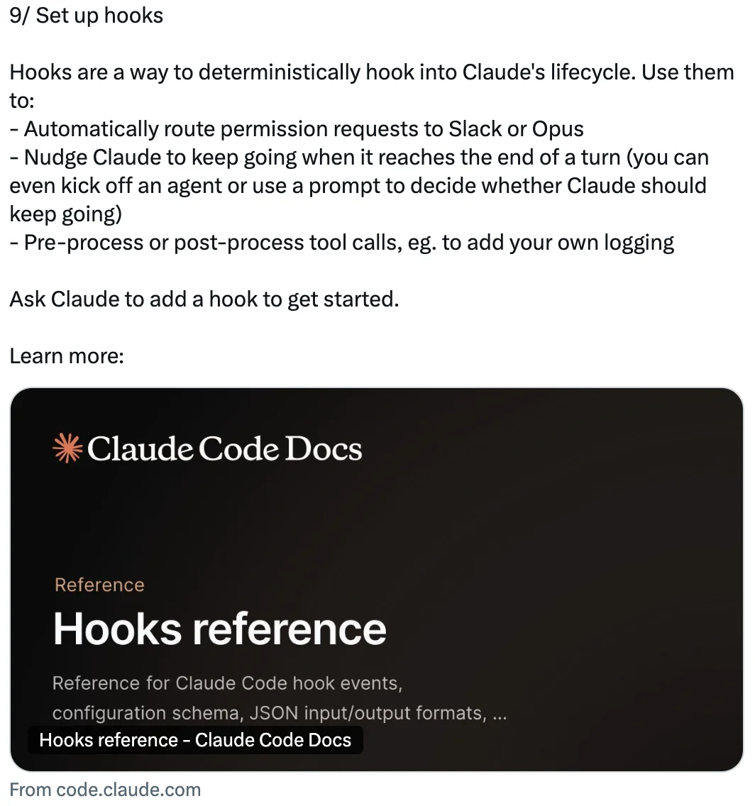
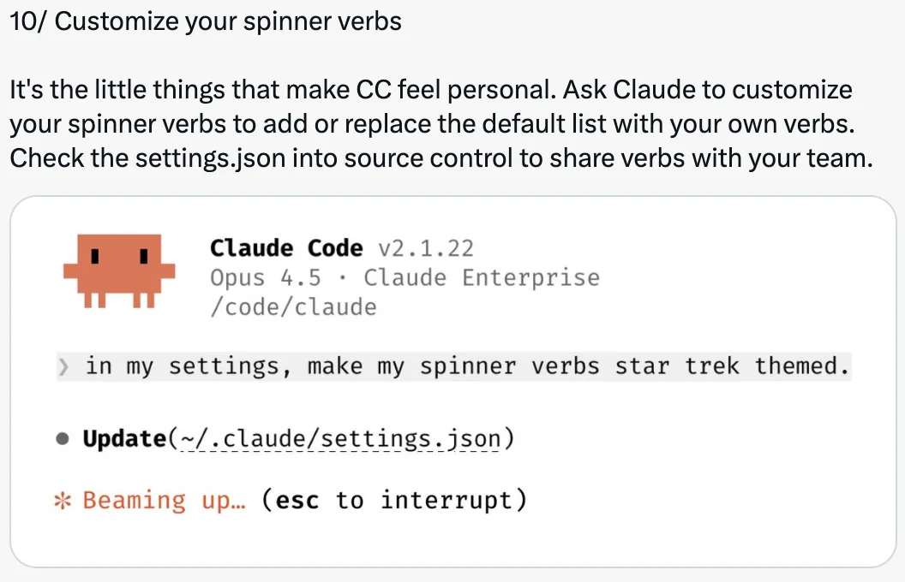

# 自定义 Claude Code 的 12 种方式 — Boris Cherny 的技巧

Boris Cherny ([@bcherny](https://x.com/bcherny))，Claude Code 的创建者，于 2026 年 2 月 12 日分享的自定义技巧总结。

<table width="100%">
<tr>
<td><a href="../">← 返回 Claude Code 最佳实践</a></td>
<td align="right"></td>
</tr>
</table>

---

## 背景

Boris Cherny 强调，可定制性是工程师最喜欢 Claude Code 的特点之一 — 钩子、插件、LSP、MCP、技能、努力程度、自定义代理、状态栏、输出风格等等。他分享了开发者和团队自定义设置的 12 种实用方式。

---

## 1/ 配置你的终端

为最佳 Claude Code 体验设置终端：

- **主题**：运行 `/config` 设置明暗模式
- **通知**：为 iTerm2 启用通知，或使用自定义通知钩子
- **换行**：如果在 IDE 终端、Apple Terminal、Warp 或 Alacritty 中使用 Claude Code，运行 `/terminal-setup` 启用 shift+enter 换行（这样就不需要输入 `\`）
- **Vim 模式**：运行 `/vim`

---

## 2/ 调整努力程度

运行 `/model` 选择你偏好的努力程度：

- **Low** — 更少 token，更快响应
- **Medium** — 平衡行为
- **High** — 更多 token，更高智能

Boris 的偏好：所有事情都用 High。

---

## 3/ 安装插件、MCP 和技能

插件让你安装 LSP（每种主流语言都有）、MCP、技能、代理和自定义钩子。

从 Anthropic 官方插件市场安装，或为你的公司创建自己的市场。将 `settings.json` 签入代码库以自动为你的团队添加市场。

运行 `/plugin` 开始使用。

---

## 4/ 创建自定义代理

在 `.claude/agents` 中放置 `.md` 文件来创建自定义代理。每个代理可以有自定义名称、颜色、工具集、预允许和预禁止的工具、权限模式和模型。

你也可以使用 `settings.json` 中的 `"agent"` 字段或 `--agent` 标志来设置主对话的默认代理。

运行 `/agents` 开始使用。

---

## 5/ 预批准常用权限

Claude Code 使用结合提示注入检测、静态分析、沙箱和人工监督的权限系统。

开箱即用时，一小部分安全命令已预批准。要预批准更多，运行 `/permissions` 并添加到允许和阻止列表中。将这些签入团队的 `settings.json`。

支持完整的通配符语法 — 例如 `Bash(bun run *)` 或 `Edit(/docs/**)`。

---

## 6/ 启用沙箱

选择加入 Claude Code 的开源沙箱运行时，以提高安全性同时减少权限提示。

运行 `/sandbox` 启用它。沙箱在你的机器上运行，支持文件和网络隔离。

---

## 7/ 添加状态栏

自定义状态栏显示在编辑器下方，展示模型、目录、剩余上下文、费用以及你工作时想看到的任何其他信息。

每个团队成员可以有不同的状态栏。使用 `/statusline` 让 Claude 基于你的 `.bashrc`/`.zshrc` 生成一个。

---

## 8/ 自定义键位绑定

Claude Code 中的每个键位绑定都可以自定义。运行 `/keybindings` 重新映射任何键。设置实时加载，你可以立即看到感觉如何。

---

## 9/ 设置钩子

钩子让你确定性地挂接到 Claude 的生命周期：

- 自动将权限请求路由到 Slack 或 Opus
- 当 Claude 到达轮次结束时推动它继续（你甚至可以启动代理或使用提示来决定 Claude 是否应该继续）
- 预处理或后处理工具调用，例如添加你自己的日志记录

让 Claude 添加一个钩子来开始使用。

---

## 10/ 自定义你的加载动词

自定义你的加载动词，添加或替换默认列表。将 `settings.json` 签入源代码控制以与团队共享动词。

---

## 11/ 使用输出风格

运行 `/config` 并设置输出风格，让 Claude 用不同的语气或格式回应。

- **Explanatory** — 推荐在熟悉新代码库时使用，让 Claude 在工作时解释框架和代码模式
- **Learning** — 让 Claude 指导你进行代码更改
- **Custom** — 创建自定义输出风格以调整 Claude 的语气

---

## 12/ 自定义一切！

Claude Code 开箱即可很好地工作，但当你自定义时，将 `settings.json` 签入 git 以便你的团队也能受益。配置支持多个级别：

- 针对你的代码库
- 针对子文件夹
- 仅针对你自己
- 通过企业范围的策略

有 37 个设置和 84 个环境变量（使用 `settings.json` 中的 `"env"` 字段来避免包装脚本），你想要的任何行为都很可能是可配置的。

---

## 来源

- [Boris Cherny (@bcherny) on X — 2026 年 2 月 12 日](https://x.com/bcherny)
- [Claude Code 终端设置文档](https://code.claude.com/docs/en/terminal)
- [Claude Code 插件与发现文档](https://code.claude.com/docs/en/discover-plugins)
- [Claude Code 子代理文档](https://code.claude.com/docs/en/sub-agents)
- [Claude Code 权限文档](https://code.claude.com/docs/en/permissions)
- [Claude Code 沙箱文档](https://code.claude.com/docs/en/sandbox)
- [Claude Code 状态栏文档](https://code.claude.com/docs/en/statusline)
- [Claude Code 键盘快捷键文档](https://code.claude.com/docs/en/keybindings)
- [Claude Code 钩子参考](https://code.claude.com/docs/en/hooks)
- [Claude Code 输出风格文档](https://code.claude.com/docs/en/output-styles)
- [Claude Code 设置文档](https://code.claude.com/docs/en/settings)
