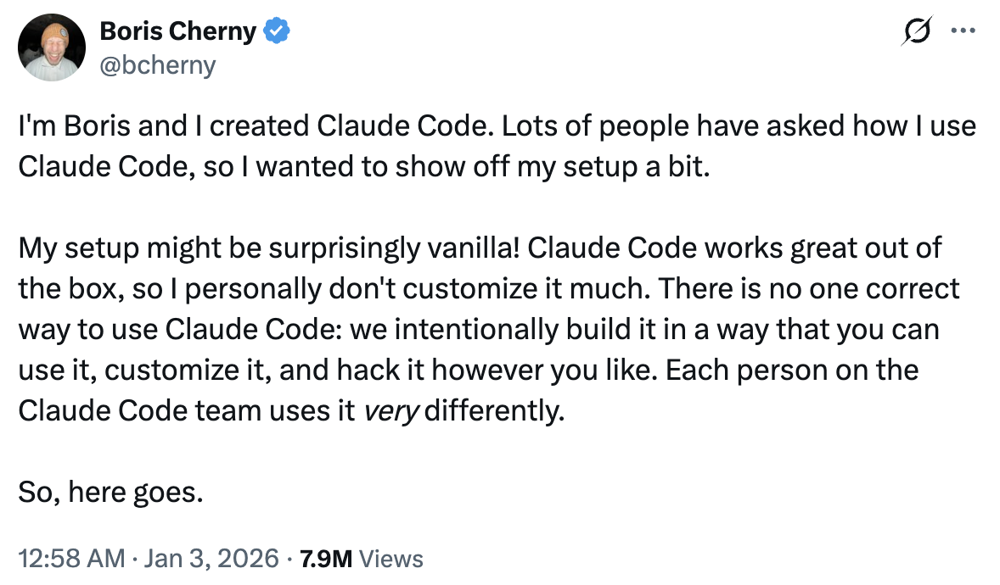
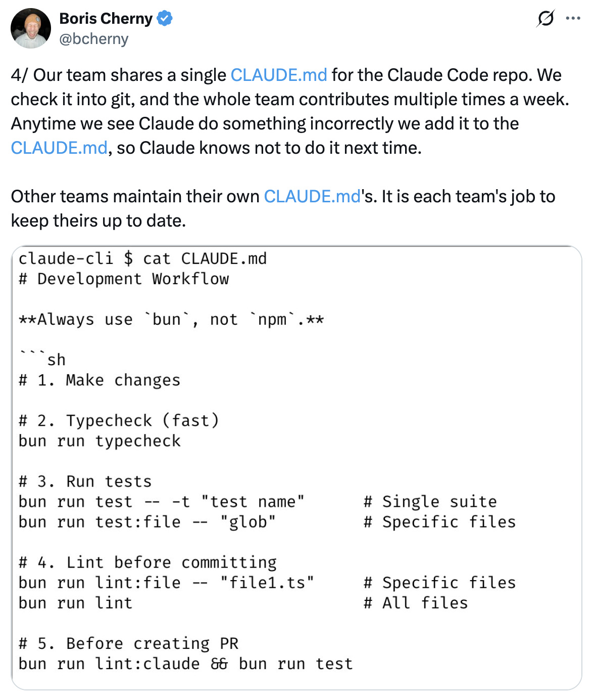
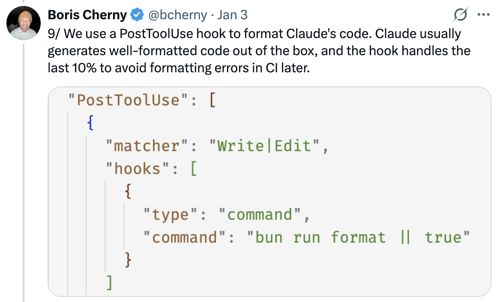
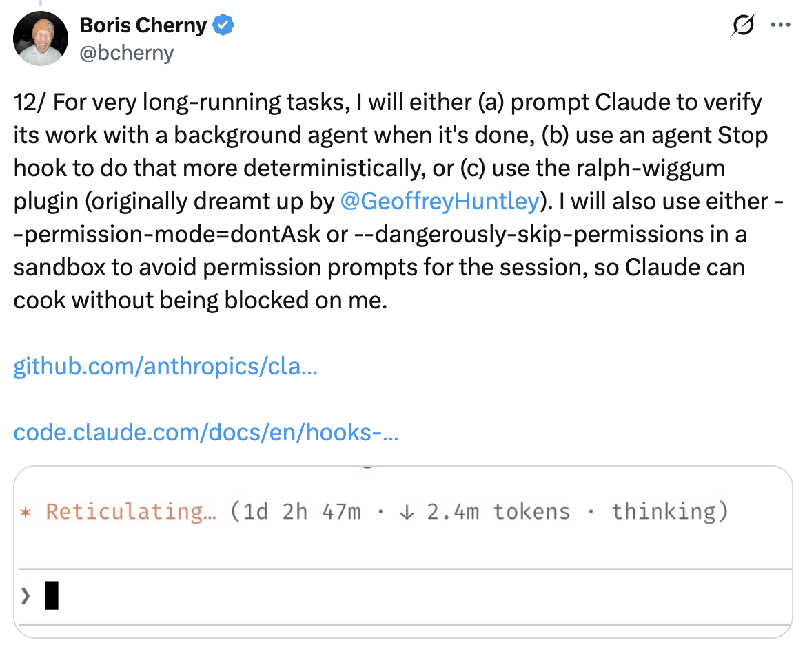

# 我如何使用 Claude Code — Boris Cherny 的 13 个技巧

Boris Cherny ([@bcherny](https://x.com/bcherny))，Claude Code 的创建者，于 2026 年 1 月 3 日分享的设置技巧总结。

<table width="100%">
<tr>
<td><a href="../">← 返回 Claude Code 最佳实践</a></td>
<td align="right"></td>
</tr>
</table>

---

## 背景

Boris 分享了他个人的 Claude Code 设置，指出它"出人意料地原生" — Claude Code 开箱即可很好地工作，所以他没有做太多自定义。使用它没有唯一正确的方式：团队有意将它构建得让你可以随意使用、自定义和改造。Claude Code 团队中每个人使用它的方式都非常不同。

<a href="https://x.com/bcherny/status/2007179832300581177"></a>

---

## 1/ 并行运行 5 个 Claude

在终端中并行运行 5 个 Claude。将标签编号 1-5，使用系统通知来知道何时 Claude 需要输入。

参见：[终端设置文档](https://code.claude.com/docs/en/terminal)

<a href="https://x.com/bcherny/status/2007179833990885678"></a>

---

## 2/ 使用 claude.ai/code 获得更多并行性

在 claude.ai/code 上并行运行 5-10 个 Claude，同时配合你的本地 Claude。使用 `claude.ai/code` 将本地会话移交到 Web 会话，在 Chrome 中手动启动会话，并来回传送。

<a href="https://x.com/bcherny/status/2007179836704600237"></a>

---

## 3/ 所有事情都使用 Opus 加思考

所有事情都使用带思考的 Opus 4.5。这是 Boris 用过的最好的编码模型 — 虽然它比 Sonnet 更大更慢，但由于你需要更少的引导，而且它更擅长工具使用，最终几乎总是比使用更小的模型更快。

<a href="https://x.com/bcherny/status/2007179838864666847"></a>

---

## 4/ 与团队共享单个 CLAUDE.md

为仓库共享单个 `CLAUDE.md`。签入 git，让整个团队每周贡献多次。每当 Claude 做错了什么，就添加到 `CLAUDE.md` 中，这样 Claude 下次就不会再犯了。

<a href="https://x.com/bcherny/status/2007179840848597422"></a>

---

## 5/ 在 PR 上标记 @claude 来更新 CLAUDE.md

在代码审查中，在同事的 PR 上标记 `@claude` 以在 PR 中向 `CLAUDE.md` 添加内容。使用 Claude Code GitHub action（[install-@hub-action](https://github.com/apps/claude)）— 这是 Boris 版本的复利工程。

<a href="https://x.com/bcherny/status/2007179842928947333"></a>

---

## 6/ 大多数会话从计划模式开始

大多数会话在计划模式下开始（shift+tab 两次）。如果目标是写一个 Pull Request，使用计划模式并与 Claude 反复讨论直到你满意它的计划。然后切换到自动接受编辑模式，Claude 通常可以一次完成。一个好的计划真的很重要。

<a href="https://x.com/bcherny/status/2007179845336527000"></a>

---

## 7/ 对内循环工作流使用斜杠命令

对每天做很多次的"内循环"工作流使用斜杠命令。这省去了重复提示，也让 Claude 可以使用这些工作流。命令签入 git 并存放在 `.claude/commands/` 中。

示例：`/commit-push-pr` — 提交、推送并打开 PR。

<a href="https://x.com/bcherny/status/2007179847949500714"></a>

---

## 8/ 使用子代理自动化常见工作流

经常使用几个子代理：`code-simplifier` 在 Claude 完成工作后简化代码，`verify-app` 有端到端测试 Claude Code 的详细指令，等等。将子代理视为自动化最常见工作流的方式 — 类似于斜杠命令。

子代理存放在 `.claude/agents/` 中。

<a href="https://x.com/bcherny/status/2007179850139000872"></a>

---

## 9/ 使用 PostToolUse 钩子自动格式化代码

使用 `PostToolUse` 钩子格式化 Claude 的代码。Claude 通常开箱即可生成格式良好的代码，钩子处理最后的 10%，避免后续 CI 中的格式错误。

```json
"PostToolUse": [
  {
    "matcher": "Write|Edit",
    "hooks": [
      {
        "type": "command",
        "command": "bun run format || true"
      }
    ]
  }
]
```

<a href="https://x.com/bcherny/status/2007179852047335529"></a>

---

## 10/ 预允许权限而不是 --dangerously-skip-permissions

不要使用 `--dangerously-skip-permissions`。取而代之，使用 `/permissions` 预允许你知道在你环境中安全的常见 bash 命令，以避免不必要的权限提示。大部分这些设置签入 `.claude/settings.json` 并与团队共享。

<a href="https://x.com/bcherny/status/2007179854077407667"></a>

---

## 11/ 让 Claude 通过 MCP 使用你的所有工具

Claude Code 使用你的所有工具。它经常搜索和发布到 Slack（通过 MCP 服务器）、运行 BigQuery 查询来回答分析问题（使用 `bq` CLI）、从 Sentry 获取错误日志等。Slack MCP 配置签入 `.mcp.json` 并与团队共享。

<a href="https://x.com/bcherny/status/2007179856266789204"></a>

---

## 12/ 用后台代理验证长时间运行的任务

对于非常长时间运行的任务，可以 (a) 提示 Claude 完成后用后台代理验证工作，(b) 使用代理 Stop 钩子更确定性地做到这一点，或 (c) 使用 ralph-wiggum 插件（最初由 @GeoffreyHuntley 构想）。

<a href="https://x.com/bcherny/status/2007179858435281082"></a>

---

## 13/ 给 Claude 一种验证工作的方式

可能是从 Claude Code 获得好结果最重要的事 — 给 Claude 一种验证其工作的方式。如果 Claude 有这个反馈循环，最终结果的质量会提升 2-3 倍。

Claude 测试 Boris 提交的每一个更改。

<a href="https://x.com/bcherny/status/2007179861115511237"></a>

---

## 来源

- [Boris Cherny (@bcherny) on X — 2026 年 1 月 3 日](https://x.com/bcherny/status/2007179832300581177)
