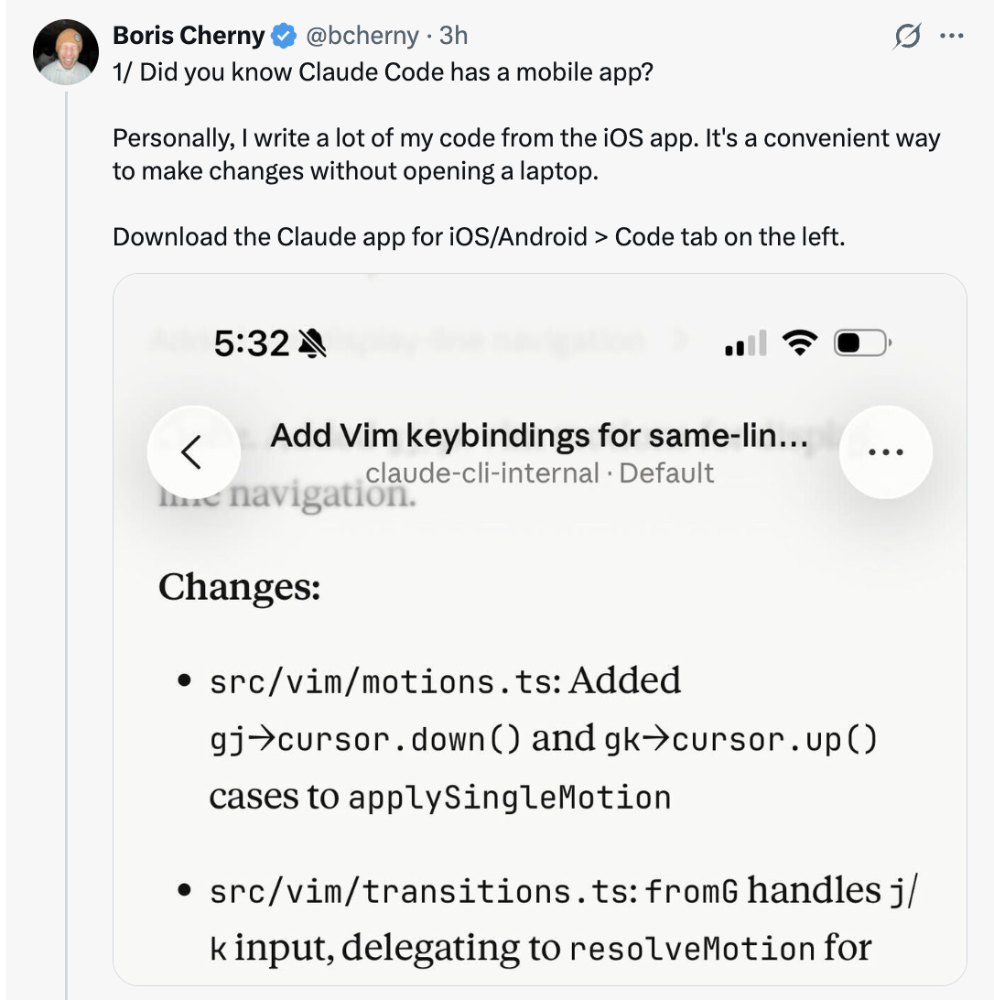
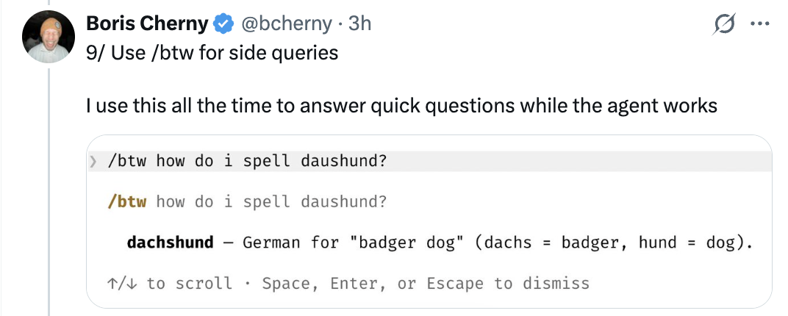
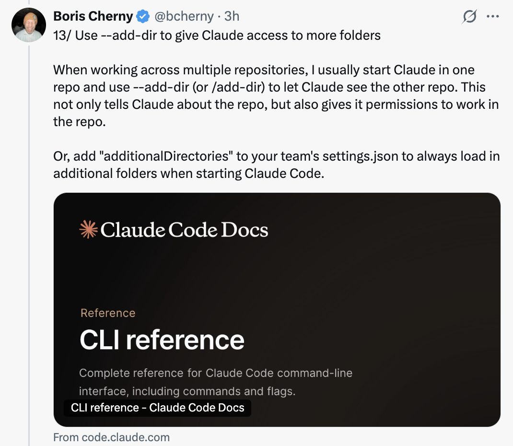

# Claude Code 中 15 个隐藏和未充分利用的功能 — Boris Cherny

Boris Cherny ([@bcherny](https://x.com/bcherny))，Claude Code 的创建者，于 2026 年 3 月 30 日分享的技巧总结。

[← 返回 Claude Code 最佳实践](../)

---

## 背景

Boris 分享了一堆他最喜欢的 Claude Code 隐藏和未充分利用的功能，重点是他使用最多的那些。

<a href="https://x.com/bcherny/status/2038454336355999749"></a>

---

## 1/ Claude Code 有移动应用

你知道 Claude Code 有移动应用吗？Boris 在 iOS 应用上写了很多代码 — 这是不用打开笔记本电脑就能做更改的便捷方式。

- 下载 iOS/Android 的 Claude 应用
- 导航到左侧的 **Code** 标签
- 你可以直接在手机上审查更改、批准 PR 和编写代码

<a href="https://x.com/bcherny/status/2038454337811386436"></a>

---

## 2/ 在移动端/Web/桌面和终端之间移动会话

运行 `claude --teleport` 或 `/teleport` 在你的机器上继续一个云端会话。或运行 `/remote-control` 从你的手机/Web 控制本地运行的会话。

- **Teleport**：将云端会话拉到你的本地终端
- **Remote Control**：让你从任何设备控制本地会话
- Boris 在 `/config` 中设置了 **"为所有会话启用远程控制"**

<a href="https://x.com/bcherny/status/2038454339933548804"></a>

---

## 3/ /loop 和 /schedule — 两个最强大的功能

使用这些来安排 Claude 以设定的间隔自动运行，最长可达一周。Boris 本地运行着一堆循环：

- `/loop 5m /babysit` — 自动处理代码审查、自动变基，并将 PR 推进到生产
- `/loop 30m /slack-feedback` — 每 30 分钟自动为 Slack 反馈创建 PR
- `/loop /post-merge-sweeper` — 为他错过的代码审查评论创建 PR
- `/loop 1h /pr-pruner` — 关闭过时和不再需要的 PR
- ...还有更多！

尝试将工作流转变为技能 + 循环。这很强大。

<a href="https://x.com/bcherny/status/2038454341884154269"></a>

---

## 4/ 使用钩子确定性地运行逻辑

使用钩子在代理生命周期中运行逻辑。例如：

- 每次启动 Claude 时**动态加载**上下文（`SessionStart`）
- **记录模型运行的每个 bash 命令**（`PreToolUse`）
- **将权限提示路由到 WhatsApp** 供你批准/拒绝（`PermissionRequest`）
- **推动 Claude** 在它停止时继续（`Stop`）

<a href="https://x.com/bcherny/status/2038454343519932844"></a>

---

## 5/ Cowork Dispatch

Boris 每天使用 Dispatch 来跟进 Slack 和邮件、管理文件，以及在不在电脑前时操作笔记本电脑。当他不在编码时，他就在 dispatch。

- Dispatch 是 Claude 桌面应用的**安全远程控制**
- 它可以使用你的 MCP、浏览器和电脑，经你许可
- 把它想象成一种从任何地方将非编码任务委托给 Claude 的方式

<a href="https://x.com/bcherny/status/2038454345419936040"></a>

---

## 6/ 使用 Chrome 扩展进行前端工作

使用 Claude Code 最重要的技巧：**给 Claude 一种验证其输出的方式。** 一旦你这样做了，Claude 会迭代直到结果很好。

- 想象一下让人建一个网站但不允许他们使用浏览器 — 结果可能看起来不好
- 给 Claude 一个浏览器，它会编写代码并迭代直到看起来好
- Boris 每次处理 Web 代码时都使用 Chrome 扩展 — 它往往比其他类似的 MCP 更可靠

<a href="https://x.com/bcherny/status/2038454347156398333"></a>

---

## 7/ 使用 Claude 桌面应用自动启动和测试 Web 服务器

同样地，桌面应用内置了让 Claude **自动运行你的 Web 服务器甚至在内置浏览器中测试它**的能力。

- 你可以在 CLI 或 VSCode 中使用 Chrome 扩展设置类似的功能
- 或者直接使用桌面应用获得集成体验

<a href="https://x.com/bcherny/status/2038454348804714642"></a>

---

## 8/ 分叉你的会话

人们经常问如何分叉现有会话。两种方式：

1. 在会话中运行 `/branch`
2. 从 CLI 运行 `claude --resume <session-id> --fork-session`

`/branch` 创建一个分叉的对话 — 你现在在分叉中。要恢复原始会话，使用 `claude -r <original-session-id>`。

<a href="https://x.com/bcherny/status/2038454350214041740"></a>

---

## 9/ 使用 /btw 进行旁问

Boris 一直用这个在代理工作时回答快速问题。`/btw` 让你在不中断代理当前任务的情况下问一个旁问。

示例：
```
/btw how do I spell dachshund?
> dachshund — German for "badger dog" (dachs + badger, hund + dog).
↑/↓ 滚动 · Space、Enter 或 Escape 关闭
```

<a href="https://x.com/bcherny/status/2038454351849787485"></a>

---

## 10/ 使用 Git 工作树

Claude Code 对 git 工作树有深度支持。工作树对于在同一仓库中进行大量并行工作至关重要。Boris **始终运行着几十个 Claude**，这就是他的做法。

- 使用 `claude -w` 在工作树中启动新会话
- 或在 Claude 桌面应用中勾选 **"worktree" 复选框**
- 对于非 git VCS 用户，使用 `WorktreeCreate` 钩子添加你自己的工作树创建逻辑

<a href="https://x.com/bcherny/status/2038454353787519164"></a>

---

## 11/ 使用 /batch 扇出大规模变更集

`/batch` 先访谈你，然后让 Claude 将工作扇出到尽可能多的**工作树代理**（几十个、几百个甚至几千个）来完成。

- 用于大型代码迁移和其他可并行化的工作
- 每个工作树代理在代码库的独立副本上独立工作

<a href="https://x.com/bcherny/status/2038454355469484142"></a>

---

## 12/ 使用 --bare 将 SDK 启动速度提升最多 10 倍

默认情况下，当你运行 `claude -p`（或 TypeScript/Python SDK）时，Claude 会搜索本地的 CLAUDE.md、设置和 MCP。但对于非交互式使用，大多数时候你想通过 `--system-prompt`、`--mcp-config`、`--settings` 等显式指定要加载什么。

- 这是 SDK 首次构建时的设计疏忽
- 未来版本中他们会将默认值翻转为 `--bare`
- 现在通过标志选择加入以获得最多 **10 倍的启动速度**

```bash
claude -p "summarize this codebase" \
    --output-format=stream-json \
    --verbose \
    --bare
```

<a href="https://x.com/bcherny/status/2038454357088457168"></a>

---

## 13/ 使用 --add-dir 给 Claude 访问更多文件夹

跨多个仓库工作时，Boris 通常在一个仓库中启动 Claude 并使用 `--add-dir`（或 `/add-dir`）让 Claude 看到另一个仓库。

- 这不仅告诉 Claude 关于该仓库的信息，还**赋予它在该仓库中工作的权限**
- 或者在团队的 `settings.json` 中添加 `"additionalDirectories"` 以在启动 Claude Code 时始终加载额外的文件夹

<a href="https://x.com/bcherny/status/2038454359047156203"></a>

---

## 14/ 使用 --agent 给 Claude Code 自定义系统提示和工具

自定义代理是一个强大但经常被忽视的原语。使用它，只需在 `.claude/agents/` 中定义一个新代理，然后运行：

```bash
claude --agent=<你的代理名称>
```

- 代理可以有受限的工具、自定义描述和特定模型
- 它们非常适合创建只读代理、专门的审查代理或特定领域的工具

<a href="https://x.com/bcherny/status/2038454360418787764"></a>

---

## 15/ 使用 /voice 启用语音输入

趣事：Boris 大部分编码是通过对 Claude 说话完成的，而不是打字。

- 在 CLI 中运行 `/voice` 然后按住空格键说话
- 在桌面端按语音按钮
- 或在 iOS 设置中启用听写

<a href="https://x.com/bcherny/status/2038454362226467112"></a>

---

## 来源

- [Boris Cherny (@bcherny) on X — 2026 年 3 月 30 日](https://x.com/bcherny/status/2038454336355999749)
