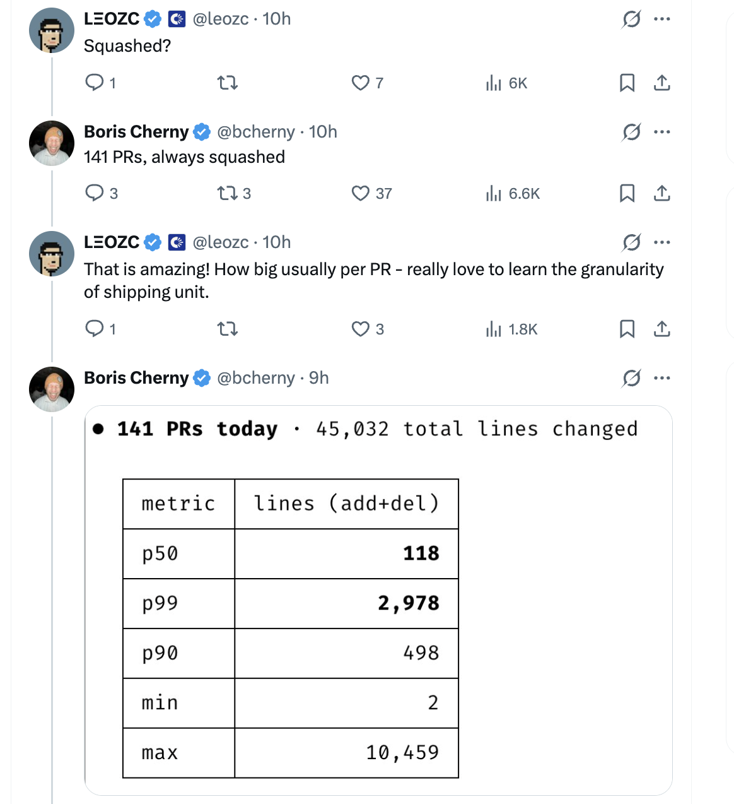

# Squash 合并与 PR 大小分布 — Boris Cherny 的技巧

Boris Cherny ([@bcherny](https://x.com/bcherny))，Claude Code 的创建者，于 2026 年 3 月 25 日分享的见解总结。

<table width="100%">
<tr>
<td><a href="../">← 返回 Claude Code 最佳实践</a></td>
<td align="right"></td>
</tr>
</table>

---

## 1/ 一天 266 个贡献 — 始终 Squash

Boris 分享了他的 GitHub 贡献图，显示 **3 月 24 日有 266 个贡献** — 来自 **141 个 PR，始终 squash**，中位数为每个 PR **118 行**。

- Squash 合并将所有分支提交合并为目标分支上的单个提交 — 保持历史干净和线性
- 每个 PR = 一个提交，方便回滚整个功能并简化 `git bisect`
- 在高速 AI 辅助工作流（每天 141 个 PR）中，squash 是务实的选择 — 分支内的"fix lint"、"try this"提交只是噪音

---

## 2/ PR 大小分布 — 保持 PR 小巧

Boris 分享了那 141 个 PR 的大小分布，总计 **45,032 行更改**（添加 + 删除）：

| 指标 | 行数 (add+del) | 含义 |
|------|---------------:|------|
| **p50** | **118** | PR 中位数大小 — 一半的 PR 为 118 行或更少 |
| p90 | 498 | 90% 的 PR 不到 500 行 |
| **p99** | **2,978** | 只有约 1 个 PR 超过约 3K 行 |
| min | 2 | 最小的 PR — 快速的 2 行修复 |
| max | 10,459 | 最大的单个 PR — 可能是迁移或生成的代码 |

- **中位数 118 行**意味着大多数 PR 是聚焦且可审查的，即使每天 141 个 PR
- 分布严重右偏 — 偶尔的大 PR 不可避免（批量重命名、迁移），但常态是紧凑的
- 小 PR 减少合并冲突风险，更易审查，与 squash 合并完美搭配以实现干净的回滚

---

## 来源

- [Boris Cherny (@bcherny) on X — 2026 年 3 月 25 日](https://x.com/bcherny)
