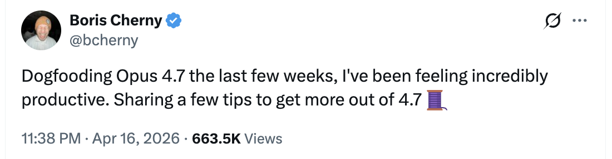
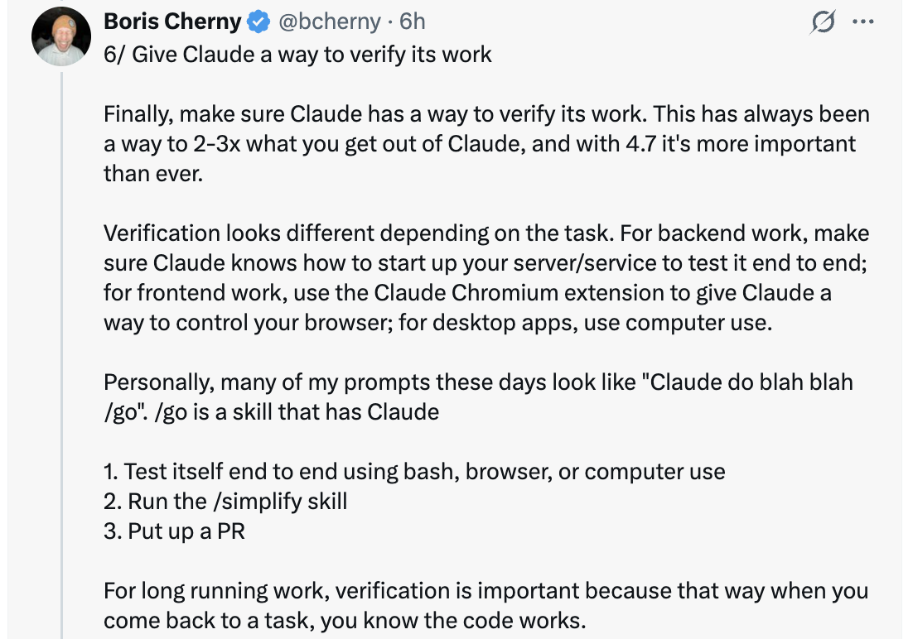

# 更好地使用 Opus 4.7 的 6 个技巧 — Boris Cherny

Boris Cherny ([@bcherny](https://x.com/bcherny))，Claude Code 的创建者，在内部测试 Opus 4.7 几周后于 2026 年 4 月 16 日分享的技巧汇总。

<table width="100%">
<tr>
<td><a href="../">← 返回 Claude Code 最佳实践</a></td>
<td align="right"></td>
</tr>
</table>

---

## 背景

在内部测试 Opus 4.7 几周后，Boris 感觉"效率极高"，分享了六种充分利用新模型的方式 — 从权限自动化到努力程度调整再到验证模式。

<a href="https://x.com/bcherny"></a>

---

## 1/ 自动模式 — 不再有权限提示

Opus 4.7 擅长执行复杂、长时间运行的任务：深度研究、重构代码、构建复杂功能、迭代直到达到性能基准。过去，你要么在模型执行这类长任务时看着它，要么使用 `--dangerously-skip-permissions`。

Anthropic 最近推出了**自动模式**作为更安全的替代方案。在此模式下，权限提示被路由到一个基于模型的分类器来决定命令是否安全运行：

- 如果安全，自动批准
- 如果有风险，暂停并询问

这意味着模型运行时不再需要看着。更重要的是，这意味着你可以并行运行更多 Claude — 如果安全，你可以将注意力切换到下一个 Claude。

自动模式现在为 Max、Teams 和 Enterprise 用户提供的 Opus 4.7 可用。在 CLI 中 **Shift+Tab** 在 `请求权限` → `计划模式` → `自动模式` 之间循环，或在桌面端或 VS Code 的下拉菜单中选择。

<a href="https://x.com/bcherny"></a>

---

## 2/ 新的 /fewer-permission-prompts 技能

Anthropic 发布了新的 `/fewer-permission-prompts` 技能。它扫描你的会话历史，找到安全但反复提示权限的常见 bash 和 MCP 命令。然后推荐一个命令列表添加到你的权限允许列表中。

使用它来调整权限并避免不必要的权限提示，特别是如果你不使用自动模式。

<a href="https://x.com/bcherny"></a>

---

## 3/ 回顾摘要

Anthropic 本周早些时候发布了**回顾摘要**，为 Opus 4.7 做准备。回顾摘要是代理所做工作和下一步的简短总结。

在离开几分钟或几个小时后返回长时间运行的会话时非常有用：

```
* 思考了 6分 27秒

* recap: 修复了提交后转录偏移的 bug。样式闪烁部分已作为 PR #29869 发布
  （自动合并已开启，已发布到 stamps）。下一步：我需要 `cc -c` 上
  剩余水平重排的屏幕录制来定位那个单独的原因。(在 /config 中禁用 recaps)
```

如果不需要可以在 `/config` 中禁用回顾摘要。

<a href="https://x.com/bcherny"></a>

---

## 4/ 专注模式

Boris 一直很喜欢 CLI 中新的**专注模式**，它隐藏所有中间工作只关注最终结果。模型已经达到了一个他通常信任它运行正确的命令和做正确的编辑的程度。他只看最终结果。

使用 `/focus` 来开关。

<a href="https://x.com/bcherny"></a>

---

## 5/ 配置你的努力程度

Opus 4.7 使用**自适应思考**而不是思考预算。要调整模型思考更多或更少，调整努力程度。

- **较低的努力程度** — 更快的响应和更低的 token 使用
- **较高的努力程度** — 最高的智能和能力

滑块呈现五个级别：`low` · `medium` · `high` · `xhigh` · `max` — 左边是速度，右边是智能。

<a href="https://x.com/bcherny"></a>

---

## 6/ 给 Claude 一种验证工作的方式

最后，确保 Claude 有一种验证其工作的方式。这一直都很重要 — 现在 4.7 是你从 Claude 获得的 2-3 倍，所以它比以往更重要。

验证因任务而异：

- **后端工作** — 让 Claude 运行你的服务器/服务来端到端测试
- **前端工作** — 使用 [Claude Chromium 扩展](https://code.claude.com/docs/en/chrome) 给 Claude 一种控制你浏览器的方式
- **桌面应用** — 使用 Computer Use

Boris 现在的提示看起来像 `Claude do blah blah /go`，其中 `/go` 是一个技能，它：

1. 使用 bash、浏览器或 computer use 进行端到端自测
2. 运行 `/simplify`
3. 创建 PR

对于长时间运行的工作，验证更加重要 — 当你回到任务时，你知道代码是有效的。

<a href="https://x.com/bcherny"></a>

---

## 来源

- [Boris Cherny (@bcherny) on X — 2026 年 4 月 16 日](https://x.com/bcherny)
