# 使用 Claude Code：会话管理与 1M 上下文 — Thariq

Thariq ([@trq212](https://x.com/trq212)) 于 2026 年 4 月 16 日分享的关于 Claude Code 中会话管理、上下文窗口和压缩的指南。

<table width="100%">
<tr>
<td><a href="../">← 返回 Claude Code 最佳实践</a></td>
<td align="right"></td>
</tr>
</table>

---

## 背景

有了 1M token 上下文窗口，Claude Code 可以更可靠地处理更长的任务 — 但如果你不刻意管理会话，它也会为上下文污染打开大门。会话管理比以往更重要：何时重新开始、何时压缩、何时回退，以及何时委托给子代理。

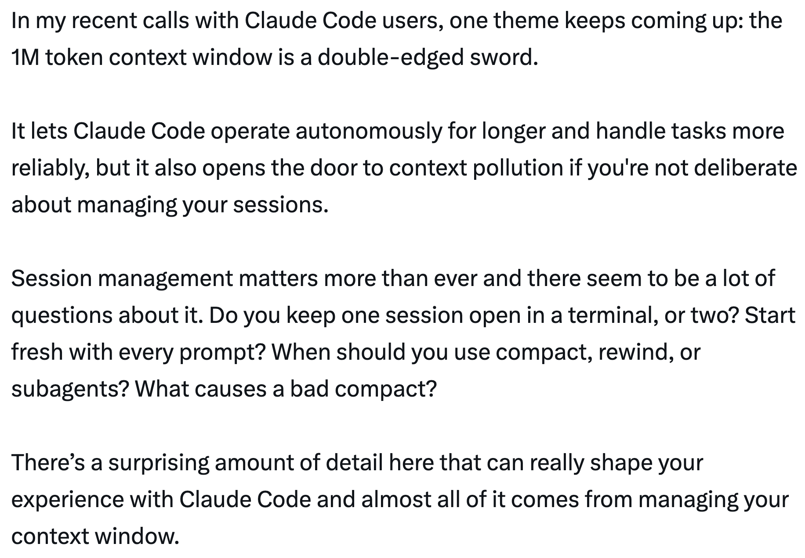

---

## 上下文、压缩与上下文腐化入门

上下文窗口是模型在生成下一个响应时能"看到"的全部内容。它包括你的系统提示、到目前为止的对话、每个工具调用及其输出，以及每个被读取的文件。Claude Code 的上下文窗口为 **一百万个 token**。

不幸的是，使用上下文有一个轻微的代价 — **上下文腐化**。随着上下文增长，模型性能会下降，因为注意力分散在更多 token 上，旧的、无关的内容开始干扰当前任务。对于 1M 上下文模型，某种程度的上下文腐化发生在约 **30-40 万 token** 左右，但这高度依赖于任务 — 不是硬性规则。

上下文窗口是一个硬性截断。当你接近末尾时，你需要总结任务并在新的上下文窗口中继续 — 这就是**压缩**。你也可以自己触发压缩。

---

## 每一轮都是一个分支点

Claude 完成一轮后，你对下一步有惊人数量的选择：

- **继续** — 在同一会话中发送另一条消息
- **/rewind (esc esc)** — 跳回到之前的消息并从那里重试
- **/clear** — 开始一个新会话，通常带有你从刚才学到的简要说明
- **压缩** — 总结到目前为止的会话并在总结之上继续
- **子代理** — 将下一块工作委托给一个有自己干净上下文的代理，只拉回它的结果

虽然最自然的是继续，但其他四个选项存在是为了帮助你管理上下文。

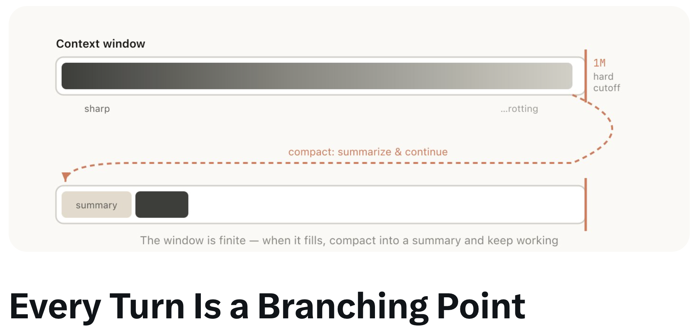

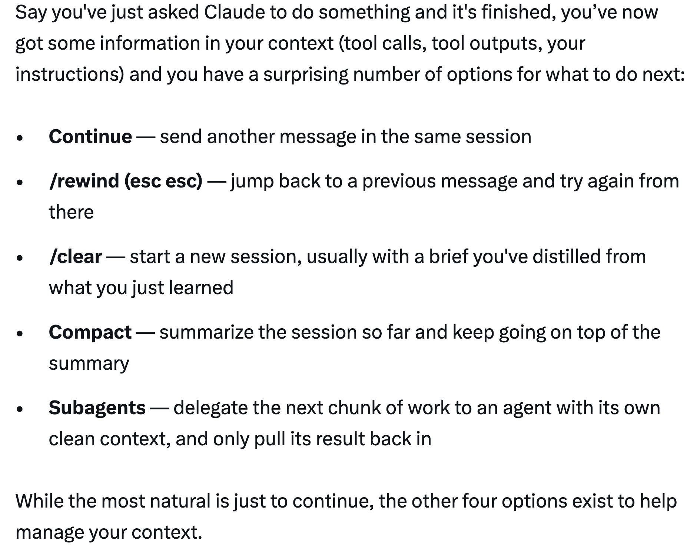

每个选项携带不同数量的现有上下文：

| 新会话 | 压缩 | 子代理 | 回退 | 继续 |
|:---:|:---:|:---:|:---:|:---:|
| 仅你的简要说明 | 有损总结 | 全部 + 结果 | 前缀保留，尾部截断 | 一切都保留 |
| *无* | | | | *全部* |

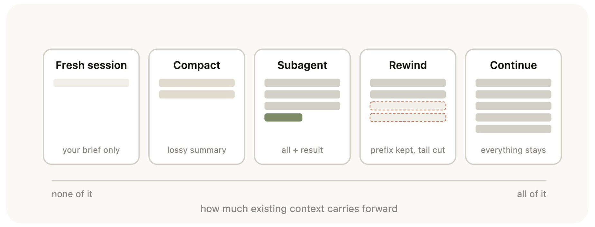

---

## 何时开始新会话

新的 1M 上下文窗口意味着你现在可以更可靠地执行更长的任务 — 例如从头构建全栈应用。但仅仅因为你的模型没有用完上下文，并不意味着你不应该开始新会话。

**一般经验法则：当你开始新任务时，你也应该开始新会话。**

灰色地带是当你可能想做相关任务，其中部分上下文仍然需要，但不是全部。例如，为你刚实现的功能编写文档。虽然你可以开始新会话，但 Claude 将不得不重新读取文件，这会更慢更贵。由于文档可能不是高度智能敏感的任务，额外的上下文可能值得效率增益。

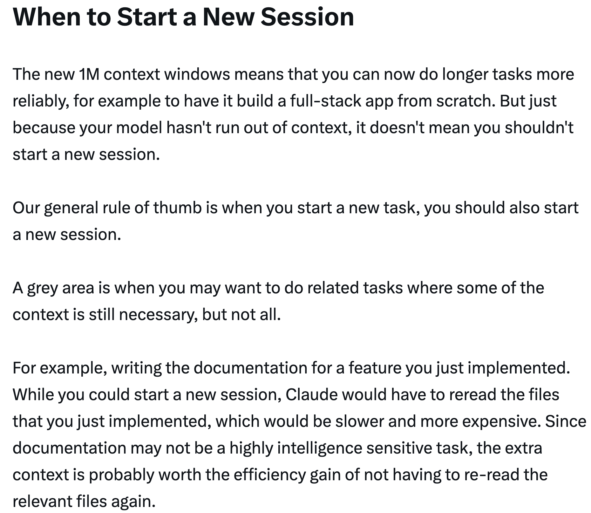

---

## 回退而不是纠正

如果 Thariq 要选一个表示良好上下文管理的习惯，那就是**回退**。

在 Claude Code 中，双击 Esc（或运行 `/rewind`）可以让你跳回到任何之前的消息并从那里重新提示。那个点之后的消息将从上下文中删除。

**纠正**（在失败的尝试 A 后说"不，试试 B"）会将失败的尝试留在上下文中：
> 上下文 = 读取 + 2 次失败尝试 + 2 次纠正 + 修复

**回退**（回到失败尝试之前并用学到的内容重新提示）更干净：
> 上下文 = 读取 + 一个知情的提示 + 修复

回退通常是更好的方法。例如，Claude 读取了五个文件，尝试了一种方法，它不起作用。你的本能可能是输入"那个不行，试试 X"。但更好的做法是回退到文件读取之后，用你学到的内容重新提示："不要用方法 A，foo 模块不暴露那个 — 直接用 B。"

你也可以使用**"从这里总结"**让 Claude 总结它的学习并创建一个交接消息，有点像是来自未来版本 Claude 给之前版本的消息，说它尝试了某事但没用。

---

## 压缩 vs. 全新会话

会话变长后，你有两种减重方式：`/compact` 或 `/clear`（重新开始）。它们感觉相似但行为非常不同。

**压缩** 要求模型总结到目前为止的对话，然后用该总结替换历史。它是有损的 — 你信任 Claude 决定什么重要，但你自己不需要写任何东西。Claude 可能在包含重要学习或文件方面更彻底。你也可以通过传递指令来引导它（`/compact 专注于 auth 重构，去掉测试调试`）。

- **任务中途**，保持势头 — 细节可以模糊
- 成本低，继续前进

**全新 + 简要说明**（`/clear`）意味着*你*写下什么重要（"我们在重构 auth 中间件，约束是 X，重要的文件是 A 和 B，我们已排除方法 Y"）并干净地开始。工作量更大，但结果上下文是*你*决定相关的内容。

- **下一步高风险** — 在 100K 探索中发现了一个事实
- 工作量更大，更精确

---

## 什么导致糟糕的压缩？

如果你运行很多长时间的会话，你可能注意到有时压缩可能特别糟糕。当模型无法预测你的工作方向时，糟糕的压缩就会发生。

例如，自动压缩在长时间调试会话后触发并总结了调查。你的下一条消息是"现在修复我们在 bar.ts 中看到的那个警告"。但因为会话专注于调试，另一个警告可能已经从总结中被丢弃。

这特别困难，因为由于上下文腐化，模型在压缩时处于其最不智能的状态。有了一百万的上下文，你有更多时间用描述你想做什么的方式主动 `/compact`。

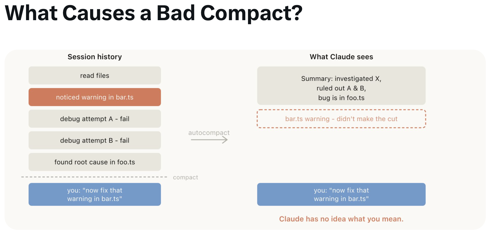

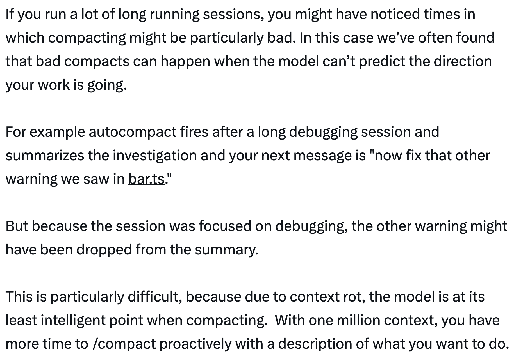

---

## 子代理与全新上下文窗口

子代理是上下文管理的一种形式，在你事先知道一块工作会产生大量你不再需要的中间输出时很有用。

当 Claude 通过 Agent 工具生成子代理时，该子代理获得自己的全新上下文窗口。它可以做尽可能多的工作，然后综合其结果，只有最终报告返回到父级。

心理测试：**我还会需要这个工具输出，还是只需要结论？**

探索噪音在子代理退出时被垃圾回收 — 20 次文件读取、12 次搜索、3 个死胡同 — 只有最终报告返回到父级上下文。

虽然 Claude Code 会自动调用子代理，但你可能想显式告诉它这样做。例如：

- "启动一个子代理根据以下规格文件验证这项工作的结果"
- "启动一个子代理读取这个其他代码库并总结它如何实现 auth 流程，然后以同样的方式自己实现"
- "启动一个子代理根据我的 git 变更为这个功能编写文档"

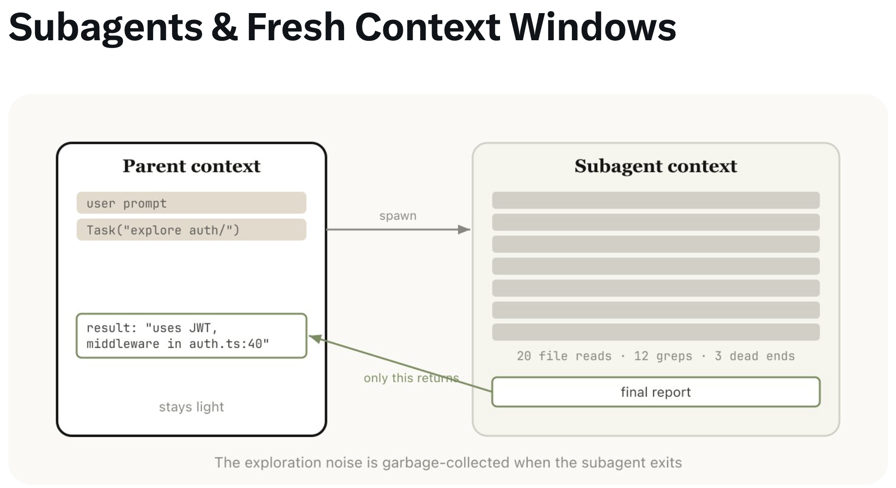

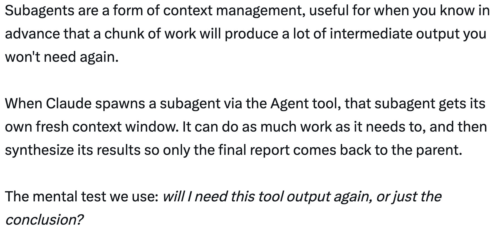

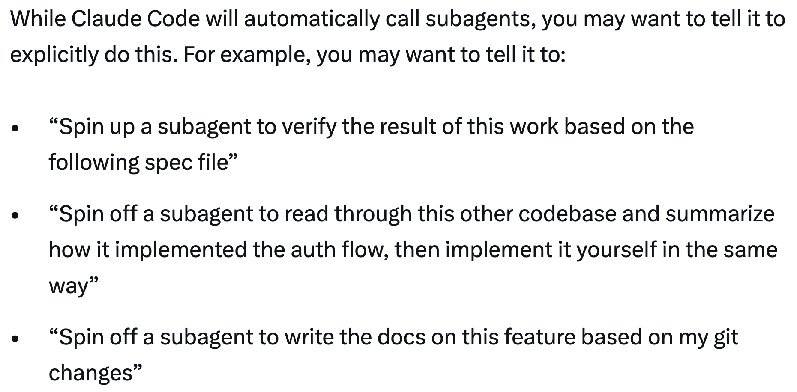

---

## 总结

当 Claude 结束一轮而你即将发送新消息时，你有一个决策点。随着时间推移，Claude 会自己处理这个，但现在这是你可以引导 Claude 输出的方式之一。

| 情况 | 选择 | 原因 |
|------|------|------|
| 同一任务，上下文仍然相关 | **继续** | 窗口中的一切仍然承载着意义 — 不要花费代价重建它 |
| Claude 走了错误的路径 | **回退** (双击 Esc) | 保留有用的文件读取，丢弃失败的尝试，用学到的内容重新提示 |
| 任务中途但会话被陈旧的调试/探索膨胀 | **/compact \<提示\>** | 低成本；Claude 决定什么重要。需要时用提示引导 |
| 开始真正的新任务 | **/clear** | 零腐化；你精确控制什么继承过来 |
| 下一步会生成大量只需要结论的输出 | **子代理** | 中间工具噪音留在子级上下文中；只有结果返回 |

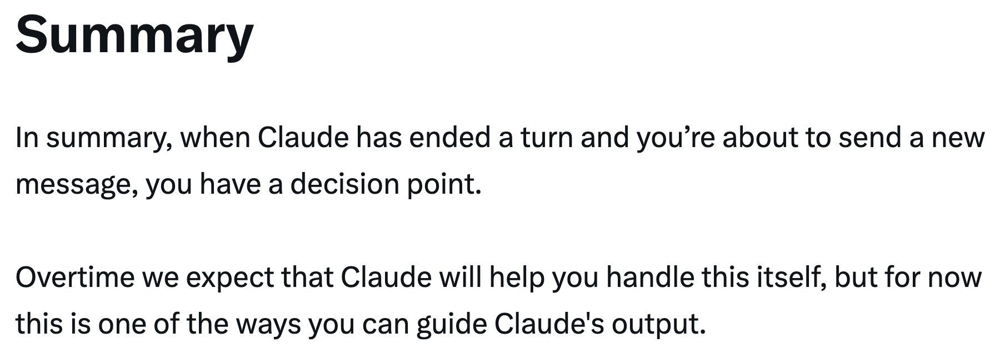

---

## 来源

- [Thariq (@trq212) on X — 2026 年 4 月 16 日](https://x.com/trq212)
