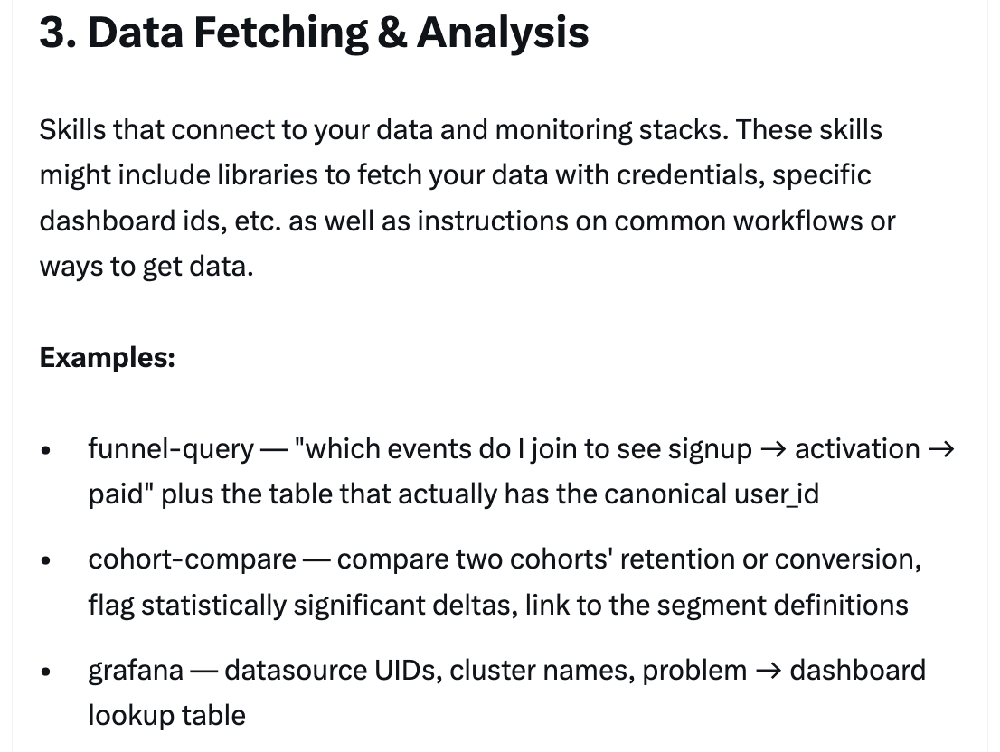
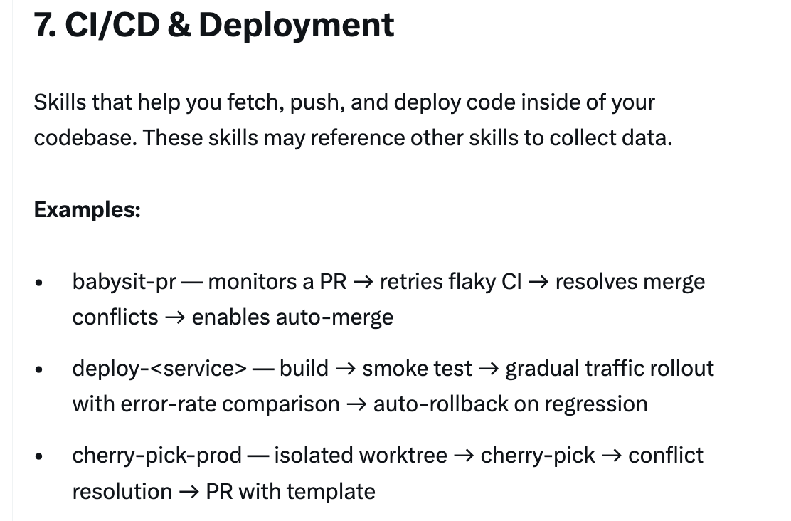
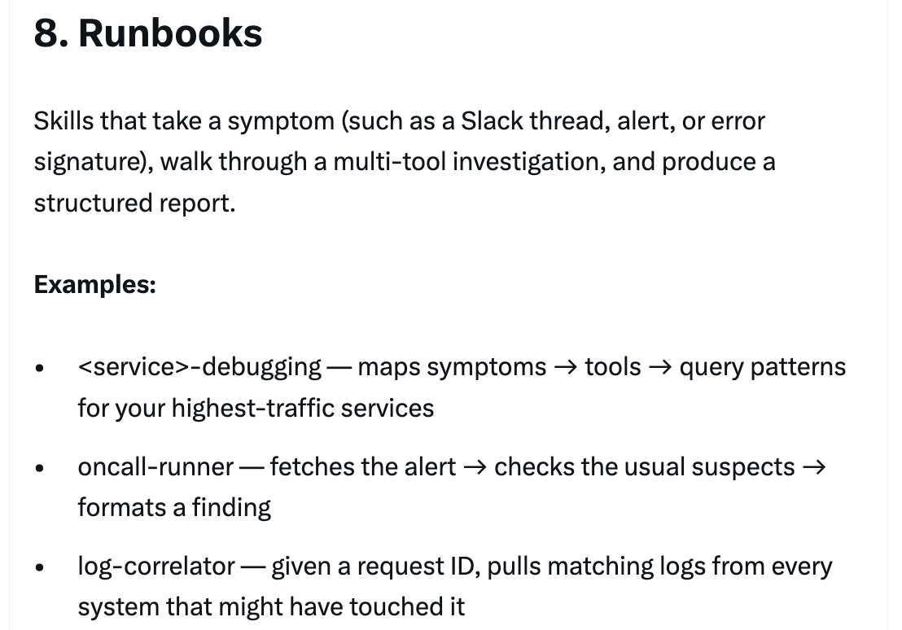
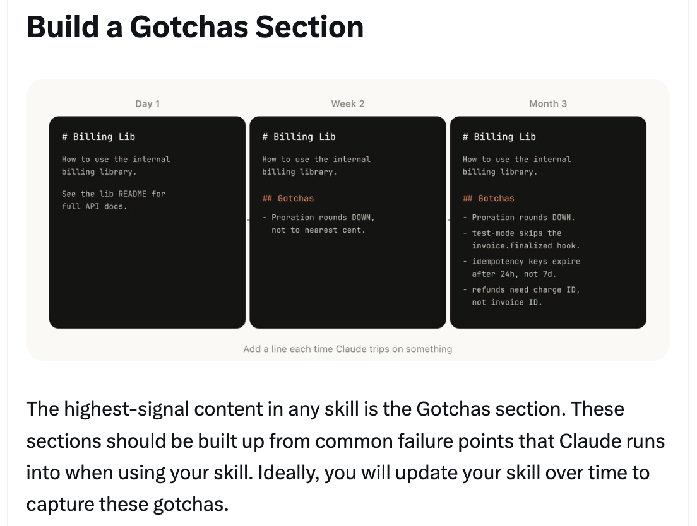
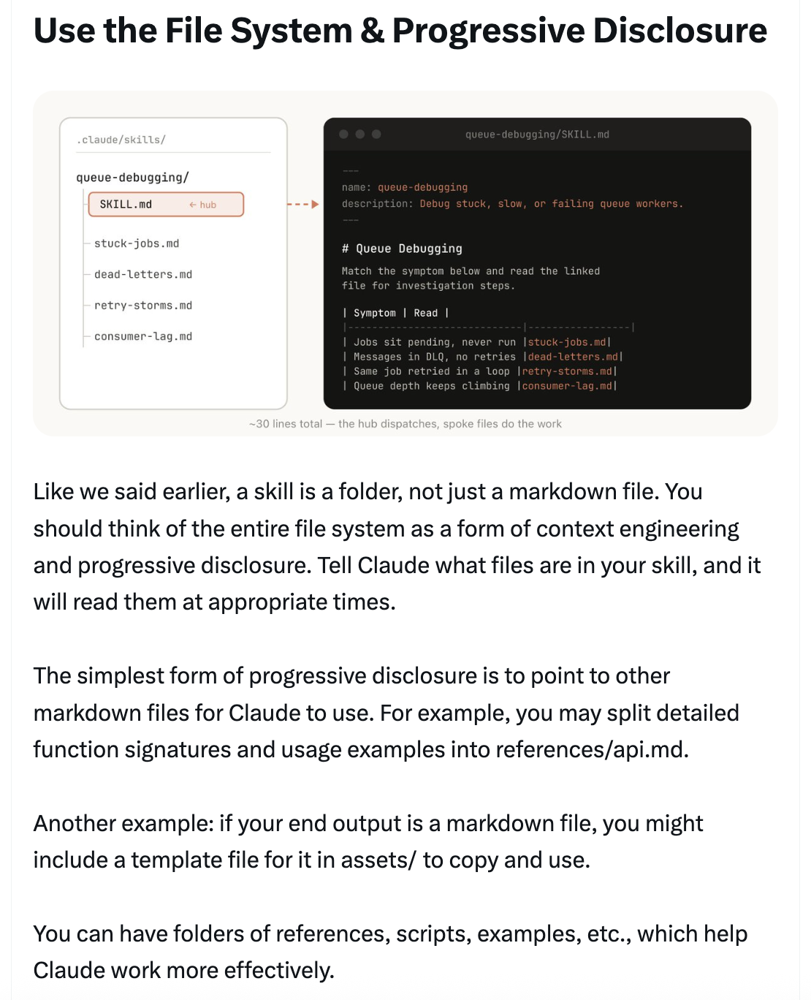
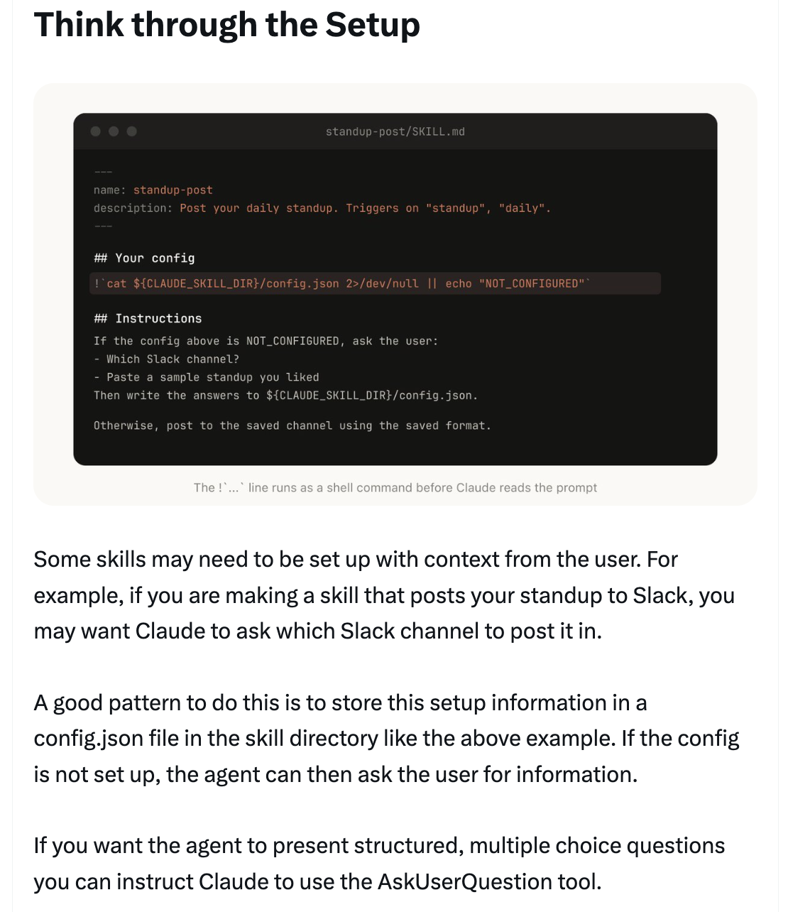
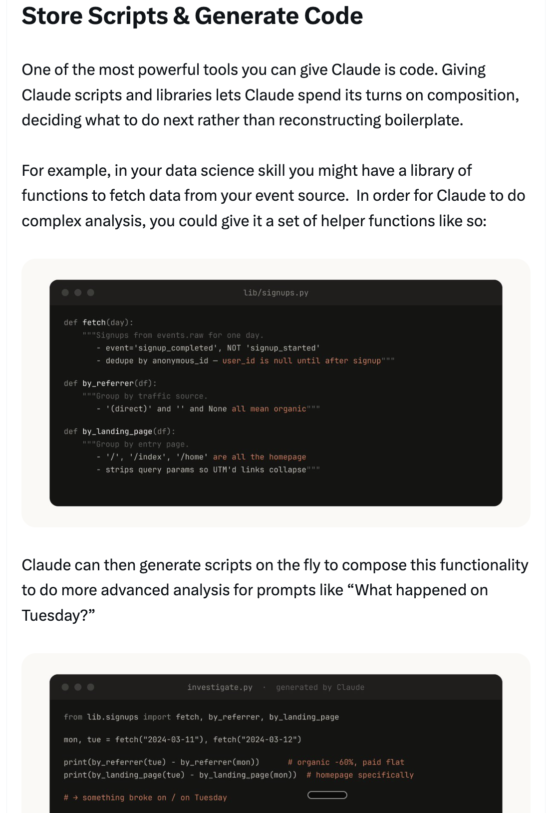
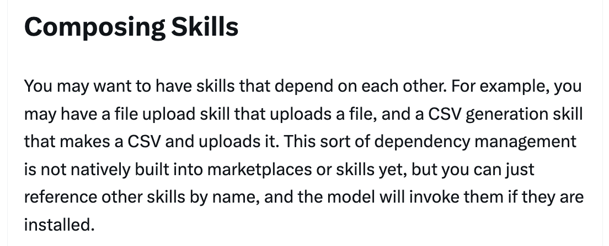
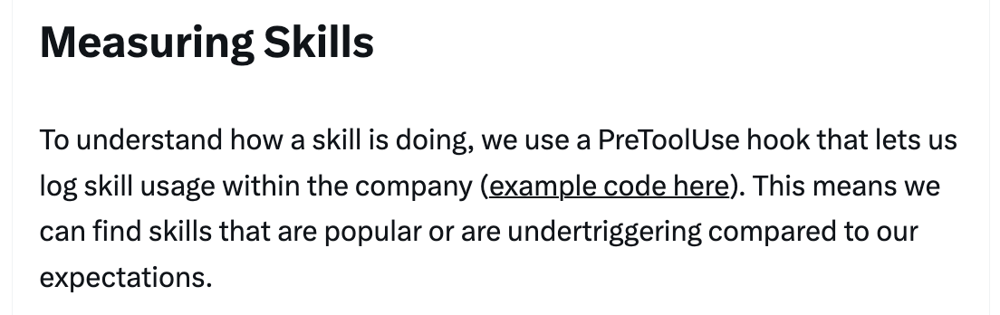

# 构建 Claude Code 的经验：我们如何使用技能 — Thariq

Thariq ([@trq212](https://x.com/trq212)) 于 2026 年 3 月 17 日分享的关于 Anthropic 内部如何使用技能的全面指南。

<table width="100%">
<tr>
<td><a href="../">← 返回 Claude Code 最佳实践</a></td>
<td align="right"></td>
</tr>
</table>

---

## 背景

技能已经成为 Claude Code 中使用最多的扩展点之一。它们灵活、易于创建且易于分发。但这种灵活性也使得难以知道什么最有效。Thariq 分享了在 Anthropic 广泛使用技能的经验，那里有数百个技能在活跃使用中。

---

## 什么是技能？

一个常见的误解是技能"只是 markdown 文件"，但最有趣的部分是它们是**文件夹**，可以包含脚本、资源、数据等 — 代理可以发现、探索和操作的内容。技能还有各种配置选项，包括注册动态钩子。

---

## 技能类型

在分类了所有技能后，团队注意到它们聚集成 9 个反复出现的类别。最好的技能清晰地属于一个类别；更令人困惑的技能跨越多个类别。

---

### 1/ 库与 API 参考

解释如何正确使用库、CLI 或 SDK 的技能。这些可以是内部库或 Claude Code 有时会出问题的常见库。它们通常包含一个参考代码片段文件夹和编写脚本时要避免的陷阱列表。

**示例：** billing-lib、internal-platform-cli、frontend-design

---

### 2/ 产品验证

描述如何测试或验证代码正在工作的技能。这些通常与 Playwright、tmux 等外部工具配对。验证技能对于确保 Claude 输出正确极其有用。值得让一个工程师花一周时间专门使验证技能变得优秀。

**示例：** signup-flow-driver、checkout-verifier、tmux-cli-driver

---

### 3/ 数据获取与分析

连接到你的数据和监控栈的技能。这些可能包含用凭据获取数据的库、特定的仪表板 ID 等，以及常见工作流或获取数据方式的说明。

**示例：** funnel-query、cohort-compare、grafana

---

### 4/ 业务流程与团队自动化

将重复性工作流自动化为一个命令的技能。这些通常是相当简单的指令，但可能对其他技能或 MCP 有更复杂的依赖。将之前的结果保存在日志文件中可以帮助模型保持一致并反思之前的工作流执行。

**示例：** standup-post、create-\<ticket-system\>-ticket、weekly-recap

---

### 5/ 代码脚手架与模板

为代码库中特定功能生成框架样板代码的技能。你可能会将这些技能与可以组合的脚本结合使用。当你的脚手架有自然语言需求无法纯粹由代码覆盖时，它们特别有用。

**示例：** new-\<framework\>-workflow、new-migration、create-app

---

### 6/ 代码质量与审查

在组织内部执行代码质量并帮助审查代码的技能。这些可以包含确定性脚本或工具以实现最大的鲁棒性。你可能想作为钩子的一部分或在 GitHub Action 中自动运行这些技能。

**示例：** adversarial-review、code-style、testing-practices

---

### 7/ CI/CD 与部署

帮助你在代码库中获取、推送和部署代码的技能。这些技能可能引用其他技能来收集数据。

**示例：** babysit-pr、deploy-\<service\>、cherry-pick-prod

---

### 8/ 运维手册

接收一个症状（如 Slack 线程、告警或错误签名），进行多工具调查，并产出结构化报告的技能。

**示例：** \<service\>-debugging、oncall-runner、log-correlator

---

### 9/ 基础设施运维

执行例行维护和运维操作的技能 — 其中一些涉及受益于护栏的破坏性操作。这些使工程师更容易在关键操作中遵循最佳实践。

**示例：** \<resource\>-orphans、dependency-management、cost-investigation

---

## 制作技能的提示

编写有效技能的 9 个最佳实践，以及分发和衡量的指导。

---

### 提示 1：不要说明显而易见的事

Claude Code 对你的代码库了解很多，Claude 对编码也了解很多，包括许多默认观点。如果你发布的技能主要是关于知识，试着关注能推动 Claude 偏离其正常思维方式的信息。前端设计技能是一个很好的例子 — 它是通过与客户迭代改进 Claude 的设计品味而建立的，避免了像 Inter 字体和紫色渐变这样的经典模式。

---

### 提示 2：建立一个"陷阱"章节

任何技能中信号最强的内容是"陷阱"章节。这些章节应从 Claude 使用你的技能时遇到的常见失败点中积累。理想情况下，你会随时间更新你的技能来捕获这些陷阱。

---

### 提示 3：使用文件系统与渐进式披露

技能是一个文件夹，不仅仅是一个 markdown 文件。你应该将整个文件系统视为上下文工程和渐进式披露的一种形式。告诉 Claude 你的技能中有什么文件，它会在适当的时候读取它们。最简单的形式是指向其他 markdown 文件 — 例如将详细的函数签名和使用示例拆分到 `references/api.md`。你可以有参考、脚本、示例等文件夹。

---

### 提示 4：避免限制 Claude 的发挥

Claude 通常会尝试遵守你的指令，由于技能可复用性很强，你需要小心不要太具体。给 Claude 它需要的信息，但给它灵活性来适应情况。给出目标和约束，而不是规定性的分步指令。

---

### 提示 5：考虑周全的设置

有些技能可能需要用户的上下文来设置。一个好的模式是将设置信息存储在技能目录的 `config.json` 文件中。如果配置未设置，代理可以向用户询问信息。你可以指示 Claude 使用 AskUserQuestion 工具进行结构化的多选问题。

---

### 提示 6：描述字段是给模型看的

当 Claude Code 开始一个会话时，它会构建每个可用技能及其描述的列表。这个列表是 Claude 用来决定"这个请求有没有技能？"的。这意味着描述字段不是摘要 — 它是关于**何时触发**这个技能的描述。为模型编写它。

---

### 提示 7：记忆与数据存储

一些技能可以通过在内部存储数据来包含一种记忆形式。你可以在简单的追加文本日志文件或 JSON 文件中存储数据，也可以在复杂的 SQLite 数据库中存储。存储在技能目录中的数据可能在升级技能时被删除，所以使用 `${CLAUDE_PLUGIN_DATA}` 作为每个插件的稳定文件夹来存储数据。

---

### 提示 8：存储脚本与生成代码

你能给 Claude 的最强大工具之一是代码。给 Claude 脚本和库让它可以将轮次花在组合上，决定下一步做什么而不是重建样板代码。Claude 然后可以即时生成脚本来组合这些功能进行更高级的分析。

---

### 提示 9：按需钩子

技能可以包含仅在技能被调用时激活的钩子，持续到会话结束。用于你不想一直运行但有时极其有用的更有主见的钩子。

**示例：**
- `/careful` — 通过 PreToolUse 匹配器在 Bash 上阻止 rm -rf、DROP TABLE、force-push、kubectl delete
- `/freeze` — 阻止不在特定目录中的任何 Edit/Write

---

## 分发技能

与团队共享技能的两种方式：
- **签入你的仓库**（在 `.claude/skills` 下）— 最适合在相对少的仓库中工作的小团队
- **制作插件**并拥有 Claude Code 插件市场，用户可以上传和安装插件

每个签入的技能也会给模型的上下文增加一点内容。随着规模扩大，内部插件市场允许你分发技能并让团队决定安装哪些。

---

## 管理市场

没有一个集中的团队来决定哪些技能进入市场。取而代之，尝试有机地找到最有用的技能。上传到 GitHub 的沙箱文件夹，并在 Slack 或其他论坛中指引人们去看。一旦技能获得了吸引力（由技能所有者决定），他们可以提交 PR 将其移入市场。发布前的策展很重要，以避免冗余技能。

---

## 组合技能

你可能想让技能相互依赖。例如，一个上传文件的技能，和一个生成 CSV 并上传它的技能。这种依赖管理还没有原生内置到市场或技能中，但你可以按名称引用其他技能，模型会在它们安装后调用它们。

---

## 衡量技能

要了解技能的表现，使用 PreToolUse 钩子记录公司内的技能使用情况。这意味着你可以找到受欢迎的技能或与预期相比触发不足的技能。

---

## 结论

技能是代理极其强大、灵活的工具，但目前仍处于早期阶段，我们都在探索如何最好地使用它们。把这更多地看作是我们看到有效的实用技巧集合，而不是权威指南。理解技能的最好方式是开始使用、实验，看看什么对你有效。我们的大部分技能开始时只有几行和一个陷阱，因为人们在 Claude 遇到新边缘情况时不断添加内容而变得更好。

---

## 来源

- [Thariq (@trq212) on X — 2026 年 3 月 17 日](https://x.com/trq212/status/2033949937936085378)
- [Skilljar — Agent Skills 课程](https://code.claude.com/docs/en/skills)
- [Skill Creator](https://code.claude.com/docs/en/skills)
